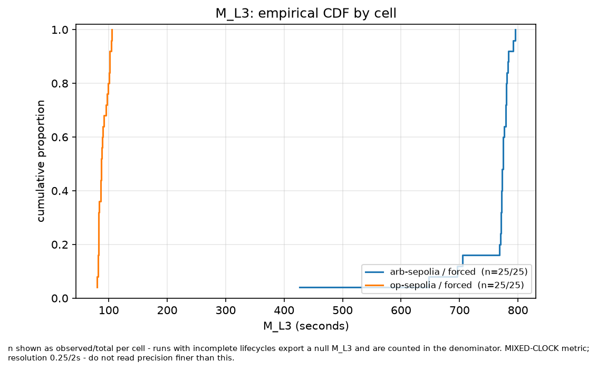
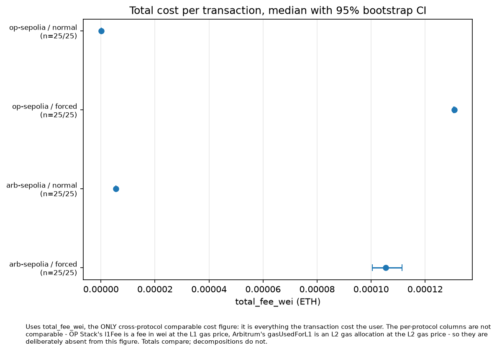
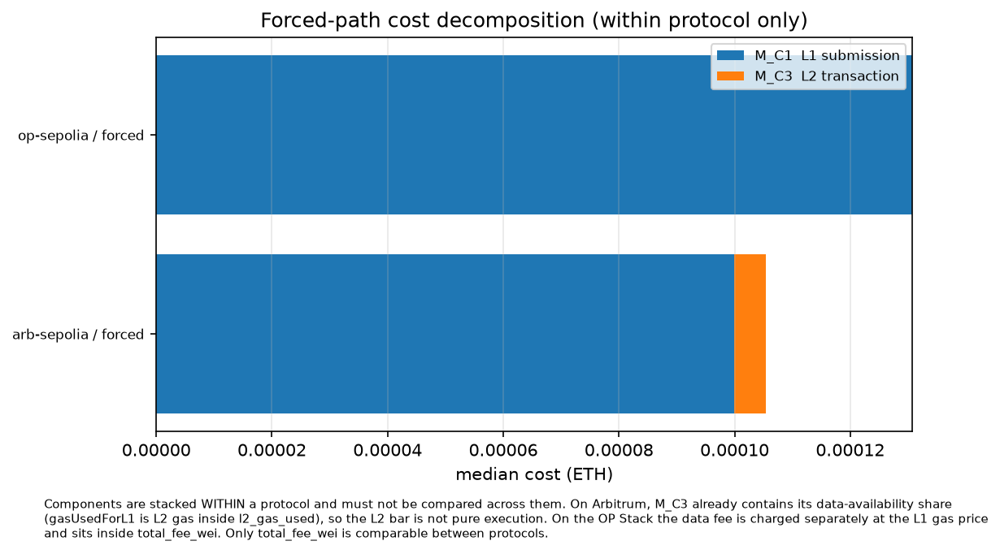
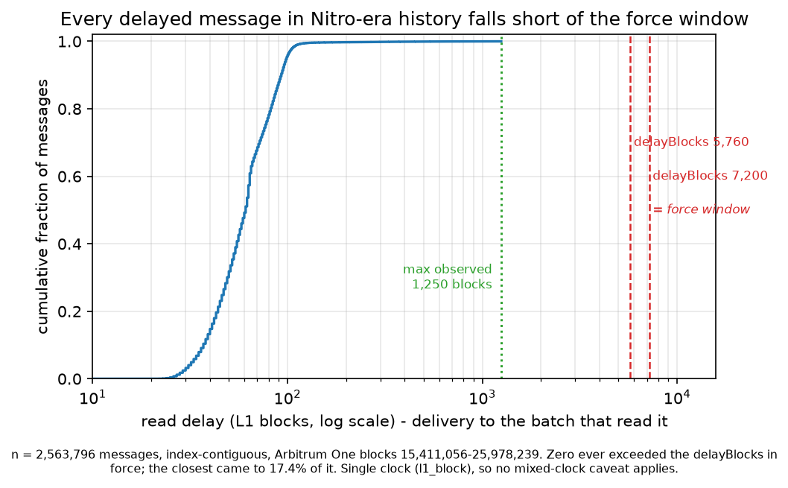

# Escape Hatches in the Wild: Measuring the Real Censorship-Resistance of Ethereum Layer-2 Rollups

**Complete draft.** All citations in §12 verified against arXiv, the ACM Digital Library, IEEE
Xplore and DBLP.

> Section numbering is contiguous: the experiment matrix and metric definitions that stood as
> separate sections in the research plan are folded into §4, and the results sections were
> renumbered to close the gap.

> **Provenance rule for this document.** Every quantitative claim carries a bracketed source:
> `[E2]` the 100-run public-testnet dataset (`data/export.csv`); `[E1]` the controlled devnet
> censorship experiment; `[M]` the mainnet census (`mainnet_events` / `mainnet_scans`);
> `[P]` a live on-chain parameter read; `[S]` source code of a deployed contract, read from
> the implementation actually deployed; `[C]` a rollup configuration file, which is **not**
> an on-chain read and is labelled separately for that reason. Bracketed **numerals** — `[1]` to
> `[6]` — are literature citations to the reference list, never provenance tags. A claim resting on a **single observation is marked
> `n=1` in the sentence that makes it**, not in a footnote. No number in this draft was
> written from memory.

---

## 1. Abstract

Every security argument for an optimistic rollup terminates in the same claim: if the
sequencer censors you, you can force your transaction in through Ethereum. This escape hatch
is load-bearing — it is what allows a centralised sequencer to be described as trust-minimised
— and it is almost always asserted from specifications rather than measured. We ask a
different question from "does the mechanism exist": *what does invoking it actually cost a
user, in latency, fees, waiting, and manual steps?*

We answer it with three complementary measurements. First, a 100-run controlled comparison on
public testnets across Arbitrum Nitro and the OP Stack [E2]. Second, a devnet experiment in
which we operate the sequencer ourselves and censor a specific transaction — the only setting
in which the word *censorship* is licensed at all [E1]. Third, a census of mainnet history
that asks how often the hatch has ever been used [M].

**The central finding is that the mechanism has never been reachable.** A census of every
delayed message Arbitrum One has ever received — 2,563,796 of them, index-contiguous — finds
that none was ever left unread for the `delayBlocks` window that `forceInclusion` requires.
The longest lapse in roughly four years of operation was 1,250 L1 blocks (~4.2 h) against a
window of 7,200: 17.4% of the way to eligibility [M]. `forceInclusion` has consequently never
been successfully called — zero in 1,332,810 batches across the contiguous 10,540,270-block
history — but that zero is a fact about the precondition, not about what users would do. The
submission leg *has* been exercised: 357 signed transactions entered through the delayed inbox,
in bursts consistent with testing, every one read by the sequencer within 24 minutes [M].

Three further results follow from the deployed contracts rather than from any one environment.
The two conditions `forceInclusion` requires are **mutually exclusive on a healthy chain**, so
the path is closed precisely when the system is working, and cannot be rehearsed on it [S, E2].
Delay-buffer depletion is **retroactive**, so BoLD's protection cannot engage during a first
censorship incident, only a sustained one [S, E1]. And forcing is a **batch operation** whose
price is set by how many messages are queued ahead of the user — a quantity they can neither
observe in advance nor control [S, E1]. The architectures also differ in kind rather than
degree: Arbitrum's forced path needs two user-initiated L1 transactions and an aliased-address
reconstruction, the OP Stack's needs one and no force call at all, and the two cost structures
are not commensurable — Arbitrum bills 94.8% on L1 and the rest as a separate L2 fee, an OP
deposit prepays execution on L1 and bills once [E2].

On the public testnets, the time from a message's L1 inclusion to its appearance on L2 differed
by an order of magnitude between the two chains — median 766 s on Arbitrum Sepolia against 76 s
on OP Sepolia, n = 25 per cell [E2]. Every Arbitrum run was auto-included, so that figure
measures the **Arbitrum Sepolia sequencer's delayed-inbox read cadence**, an operator
configuration, and not the protocol; it is reported as such and does not transfer to mainnet.

We release the harness, the dataset, and a reproducible devnet censorship protocol, along with
the instrument-verification discipline the null result required. Prior work designs these
mechanisms [1, 2], formally models them [3], analyses their usability from public metadata [4],
or attacks the path that makes them necessary [5, 6]. To our knowledge this is the first work to
measure whether invoking one has ever been possible.

---

## 2. Introduction

### 2.1 A guarantee that is asserted more often than it is exercised

An optimistic rollup executes transactions off-chain and publishes data to Ethereum. A single
sequencer typically decides ordering, which is a centralisation that rollup designers
acknowledge and then defuse with one argument: the sequencer cannot *permanently* exclude you,
because you may submit your transaction through an L1 contract that the rollup is obliged to
honour. Arbitrum calls this the delayed inbox and `forceInclusion`; the OP Stack calls it a
deposit, and its derivation pipeline is required to include it.

This argument does a great deal of work. It appears in security documentation, in third-party
risk assessments, and in the informal reasoning by which users accept a centralised sequencer.
It is also, in practice, an argument about a mechanism that is rarely exercised and — as we
show — is *structurally difficult* to exercise while the system is behaving normally.

The literature reflects this asymmetry. Escape-hatch mechanisms are designed and their ideal
properties specified [1, 2]; forced transaction queues are formally modelled and model-checked
[3]; the gap between a hatch being *present* and being *usable* has been explicitly flagged from
public metadata and incident reports [4]; and the sequencer failure that would make a hatch
necessary has been shown to be inducible at zero cost [5]. But the question a user would ask —
*if I need this, what happens to me?* — is answered by specification rather than by measurement,
and the prior question of whether the mechanism has ever been reachable at all is, as far as we
can establish, unasked. §12 positions this work against each branch.

### 2.2 The gap we address

"Censorship resistance" is usually reported as a binary property: the escape hatch exists, or
it does not. That framing hides everything a user experiences. A mechanism that requires two
separate L1 transactions, a 24-hour wait, correct reconstruction of six event fields, and
knowledge that the function even exists is not equivalent to one that happens automatically,
even though both are marked present.

We therefore treat censorship resistance as a *cost*, and measure it along the four dimensions
formalised in §4.1: **latency** (how long), **fees** (how much), **manual steps** (how many
user-initiated L1 transactions, and what the user must know), and **reliability** (how often an
attempt succeeds, with failures kept in the denominator). Latency decomposes further into work
and protocol-mandated *waiting*, and the stage model of §4.2 separates them — on Arbitrum the
waiting dominates by three orders of magnitude, and §7.5 gives it a number. These map onto the
metric families used throughout: M-L\* latency, M-C\* cost, M-R\* reliability, M-U\* user
action.

### 2.3 Why this is hard to measure honestly

Three difficulties shape our design, and each is a place where a careless measurement produces
a confident wrong number.

**Censorship cannot be observed on a public network.** We do not control any production
sequencer and make no claim about any operator's behaviour. A forced-path measurement on a
public testnet describes a user who *chooses* not to rely on the sequencer, not one who
*cannot* — and conflating the two would be the central error of the field. We enforce this
distinction in the metric names and the exported column names, not only in prose.

**The clocks disagree.** A forced-path latency spans an L1 block timestamp and an L2 block
timestamp. These are different clocks with different resolutions and different failure modes.
In our devnet run, computing latency naively across them yielded 73 s against an L1-only lower
bound of 93 s — an *impossible* result, since a transaction cannot appear on L2 before the L1
block that forced it in [E1]. The cause was sequencer backlog under load: the L2 clock trailed
real time, and six consecutive L2 blocks shared one timestamp. We therefore record a clock
source with every observation, flag mixed-clock metrics, never report precision finer than the
coarsest clock involved, and ship a validity check that tests the whole dataset for exactly
this impossibility.

**The interesting population is tiny, and the confounding population is enormous.** OP Stack
deposits are dominated by routine bridging, and nothing on the event distinguishes a routine
deposit from a user routing around a sequencer. Treating deposit volume as censorship-hatch
usage would produce a large, meaningless number. We classify it as ordinary inclusion *by
construction* and say so.

### 2.4 Contributions

Ordered by strength, and pruned to what survives §10. An earlier version of this list had six
entries, two of which §10 conceded away; this one is shorter on purpose.

1. **Arbitrum One's escape hatch has never been reachable.** A census of every delayed message
   the chain has received — 2,563,796, index-contiguous, paired with every batch that read
   them — finds that none was ever left unread for the `delayBlocks` window. The longest lapse
   in roughly four years reached 17.4% of it [M]. `forceInclusion` has consequently never been
   called, and that zero is a property of the precondition rather than of user behaviour. We
   know of no prior measurement of this quantity, and it is the fact from which most of the
   paper's other claims follow.

2. **Three properties of the deployed mechanism that explain and bound the guarantee.** Each is
   verified against the implementation actually running, not against documentation, and each
   has a consequence a specification reader would not anticipate: the two conditions
   `forceInclusion` requires are *mutually exclusive on a healthy chain*, so the path closes
   exactly when the system is behaving [S, P, E2]; delay-buffer depletion is *retroactive*, so
   BoLD cannot engage during a first censorship incident [S, E1]; and forcing is *batch-priced*,
   so the cost of recourse is set by a queue depth the user can neither observe nor control
   [S, E1]. §12.5 settles which of these are new. Only the retroactive depletion is absent from
   the prior literature and from the vendor's own documentation; the other two are consequences
   of desiderata Gorzny et al. [1] set out in 2022, and our contribution to them is to locate
   them in the deployed contract, state the mechanism exactly, and measure the first.

3. **The architectural asymmetry, in what a user must do and what they are billed.** Arbitrum's
   forced path requires two user-initiated L1 transactions and the reconstruction of six event
   fields including an aliased sender; the OP Stack requires one and nothing else [S, E1]. The
   two cost structures are not commensurable: Arbitrum bills 94.8% on L1 and the remainder as a
   separate L2 fee, an OP deposit prepays execution on L1 and bills once, so a comparison of
   totals alone misleads about which is cheaper for a user [E2].

4. **A reproducible apparatus, and a discipline for measuring rare events.** A devnet protocol
   that induces genuine censorship and recovers from it — which gives an existence proof that
   the mechanism works, on **n = 1** and at parameters no production chain runs (§10.2), and
   not a characterisation of cost. Alongside it: the released harness and dataset (§11), and
   the instrument-verification practice of §8.8 — an eight-check suite for rare-event
   measurement, together with a statement of what it would *not* catch, grounded in seven
   measurement errors that arose here (Appendix A), each of which would have biased the result
   toward this paper's conclusion.

---

## 3. Background

### 3.1 Rollups, sequencers, and the L1 fallback

A rollup executes transactions off-chain and posts data to Ethereum sufficient to reconstruct
its state. Users normally submit to a sequencer, which orders transactions and produces L2
blocks quickly. The sequencer's ordering power is the centralisation in question. Every design
in scope answers it the same way: provide an L1 route by which a transaction enters the rollup
without the sequencer's cooperation.

The two families in this study take structurally different routes, and the difference is the
paper's spine.

### 3.2 Arbitrum Nitro: the delayed inbox and `forceInclusion`

A user calls `Inbox.sendL2Message` on Ethereum with a fully signed L2 transaction, wrapped
with a leading type byte (`0x04`, "a complete signed transaction, execute as-is"). This
enqueues a *delayed message*; the `Bridge` emits `MessageDelivered` recording the message's
index, kind, sender, data hash, L1 base fee and timestamp.

Normally the sequencer reads delayed messages voluntarily and includes them within minutes. If
it does not, the user may — after a delay — call `SequencerInbox.forceInclusion` on L1, which
forces the messages in.

Three details matter and are easy to get wrong; each was verified against the deployed source
rather than documentation [S].

**The gate is `delayBlocks`, not `delaySeconds`.** The only guard in `forceInclusion` is
`l1BlockAndTime[0] + delayBlocks_ >= block.number`; `delaySeconds` is never read on this path,
and no time-based revert exists in the current implementation. On Arbitrum One today these
agree (`delayBlocks = 7200` at ~12 s ≈ `delaySeconds = 86400`) [P], so the published 24-hour
figure is correct — but the parameter a researcher must manipulate is the block count, and it
has not always been 7,200: from Nitro launch until the BoLD upgrade at block 21,830,860 it was
**5,760** [P], about 19 hours at 12-second blocks, while `delaySeconds` stayed at 86,400
throughout. Any historical question about eligibility has to use the value in force at the
time.

**The sender is aliased.** `sendL2Message` records the L1→L2 *aliased* address in
`MessageDelivered`, not the caller. Reconstructing `forceInclusion`'s arguments with the raw
caller address fails the accumulator preimage check [E1].

**Forcing is a batch operation.** `forceInclusion` takes `_totalDelayedMessagesRead` — a count
to read *up to*, not a message identifier — and includes every message queued ahead of the
caller's own. There is no variant that includes one message selectively [S].

### 3.3 The delay buffer (BoLD)

Recent Arbitrum deployments make the force window shrink under sustained delay. The effective
gate is `min(bufferBlocks, delayBlocks)`, and depletion saturates at a configured `threshold`,
so `threshold` is the floor — **denominated in L1 blocks, not in time**. Arbitrum One reports
`threshold = 150` [P], which is ~30 minutes at 12-second blocks; our devnet's deployment
reports `threshold = 600` [P], ~10 minutes at its measured ~1 s blocks. Both are real values
from different configurations, and quoting the duration without naming the configuration is an
error we make explicit because we made it ourselves before checking.

### 3.4 OP Stack: deposits and derivation

A user calls `OptimismPortal.depositTransaction` on Ethereum. The portal emits
`TransactionDeposited`, and the rollup's derivation pipeline is *required* to include the
resulting L2 transaction (type `0x7E`) within a **sequencing window of 3600 L1 blocks**,
≈12 h at 12-second blocks [C]. This bound is declared in the rollup configuration
(superchain-registry, `seq_window_size`), not read from a contract, and the value we verified
is OP Sepolia's; unlike Arbitrum's `delayBlocks`, it is not queryable on-chain, which is
itself a small asymmetry in how checkable the two guarantees are.

There is no force call, and no eligibility condition to wait for. This is not an omission in
our harness: our protocol adapter's `completeForced()` returns `null` for the OP Stack, and
that null *is* the M-U1 measurement — the count of user-initiated L1 transactions.

### 3.5 Why the same event cannot answer the usage question on the OP Stack

`TransactionDeposited` is emitted identically whether it carries a routine bridge deposit or a
user bypassing a stalled sequencer. No field distinguishes them. Any measurement of "escape
hatch usage" on the OP Stack that counts deposits is therefore measuring bridging volume. We
report OP deposits as *mechanism usage* and never as evidence of censorship.

---

## 4. Problem Definition

### 4.1 From a binary property to a cost vector

We define the object of study as the **cost of exercising forced inclusion**, for a user who
has decided not to rely on the sequencer. Formally, for a transaction *t* on rollup *R*:

- **Latency** — elapsed time from the user's first action to *t* executing on L2, decomposed
  into independently observable stages so that protocol-mandated waiting is separable from
  work.
- **Fees** — total wei spent across every leg, on L1 and L2.
- **Manual steps** — the number of user-initiated L1 transactions (M-U1), plus the knowledge
  required to construct them.
- **Reliability** — the fraction of attempts that succeed, with failures and timeouts retained
  in the denominator.

### 4.2 The stage model

A run is decomposed into stages S1–S9 (Table 1), each recorded with a block number, a timestamp,
a clock source, and a confidence:

| Stage | Meaning | Clock |
|---|---|---|
| S1 | transaction generated (signed) | wall |
| S2 | submitted to path | wall |
| S3 | L1 inclusion of submission | l1_block |
| S4 | protocol queue entry (`MessageDelivered` / `TransactionDeposited`) | l1_block |
| S5 | force eligibility | l1_block, **inferred** |
| S6 | force action (`forceInclusion`) | l1_block |
| S7 | L2 appearance | l2_block |
| S8 | L2 execution | l2_block |
| S9 | L1 finality | l1_block |

**Table 1.** The stage model. S5 is the only inferred stage; S6 exists only for Arbitrum, and is absent from the OP Stack by construction rather than unobserved.
S5 is the only inferred stage: it is a *computed* eligibility time, not an observation of a
block that carried anything. S6 exists only for Arbitrum. On the OP Stack S5 and S6 are absent
by construction, and their absence is data.

The headline latency metrics are **M-L2** (S3 → S7, L1 inclusion to L2 appearance — the one
metric both families genuinely share), **M-L3** (S2 → S7, forced path end-to-end), **M-L4**
(S1 → S8, normal path), and **M-L5** (censorship onset → L2 appearance, definable only in E1).

### 4.3 The three-clock discipline

There are exactly three clocks (Table 2), and mixing them silently is the failure mode that
produces confidently wrong latencies:

| Clock | Resolution | Valid for |
|---|---|---|
| `wall` | ms | client-side stages only |
| `l1_block` | ~12 s, proposer-set | L1 inclusion ordering |
| `l2_block` | 2 s (OP) / ~250 ms (Arbitrum) | L2 appearance ordering |

**Table 2.** The three clocks. No latency is reported at finer precision than the coarsest clock it spans, and every metric carries a mixed-clock flag and a resolution column.
Every recorded observation stores its clock source. Any metric spanning two clocks is exported
with a mixed-clock flag and a resolution column, and precision is never reported finer than
the coarsest clock involved. We validate the whole dataset against the one relation that
admits no argument — a transaction cannot appear on L2 before the L1 block that carried it —
and report the result as a validity check rather than assuming it.

### 4.4 Environments, and what each can support

No single environment can answer the research question; Table 3 states what each can support,
and the design uses all three for that reason.

| | E1 devnet | E2 public testnet | E3 mainnet |
|---|---|---|---|
| Sequencer under our control | yes | no | no |
| Genuine censorship creatable | **yes** | no | no |
| Real fee market | no | approximate | yes |
| Supports M-L5 | yes | no | no |
| Supports usage census | no | no | yes |

**Table 3.** What each environment can support. No single environment answers the research question, which is why all three are present.
Only E1 can demonstrate censorship. Only E3 can say how often the mechanism is used. E2
supplies the controlled cross-protocol comparison. No single environment answers the question,
which is why all three are present.

### 4.5 Mainnet event classification

Historical mainnet events are classified strictly, and a class is never upgraded to improve a
count:

- **Class A** — a *successful* `forceInclusion` call. Unambiguous.
- **Class B** — a delayed message not read within the window the protocol itself calls
  expected, later batched. Suggestive of a lagging sequencer; not proof of censorship.
- **Class C** — ordinary inclusion, including *all* OP Stack deposits, by construction.
- **Class D** — insufficient evidence.

Class D is not failure; it is the honest label for an event whose evidence ran out, typically
at a scan boundary. Every classified row stores the evidence string that justifies its label.

---

## 5. Threat Model

### 5.1 Definition

**Censorship** is an L2 sequencer that intentionally and persistently refuses to include an
otherwise-valid transaction, while remaining live and producing blocks containing other
transactions.

Validity is held constant and verified rather than assumed: sufficient balance, correct nonce,
adequate gas limit and price, well-formed signature, and repeated submission. Liveness is
verified *concurrently* — the sequencer must be demonstrably producing blocks containing other
users' transactions throughout the censorship window. Without that concurrent check, "my
transaction did not appear" is indistinguishable from "the chain halted", and only the first
is censorship.

This condition is creatable **only in E1**, because it requires operating the sequencer.

### 5.2 What the adversary can and cannot do

The adversary is the sequencer operator. It may reorder, delay, or indefinitely exclude any
transaction from L2 blocks, and may do so selectively. It may not forge signatures, alter L1
state, prevent the user from transacting on L1, or stop the L1 chain. Ethereum itself is
assumed live and censorship-resistant; the rollup's escape hatch is only as strong as that
assumption, which we inherit rather than test.

We also consider a weaker, non-operator adversary in one specific place. Because forcing is a
batch operation (§3.2), any party may enqueue delayed messages at ordinary L1 cost, and each
one is prepended to the bill of the next user who forces. This is an availability-of-recourse
concern rather than an inclusion concern, and we treat it as such.

### 5.3 Explicit non-claims

These are stated as prominently as the findings, because the difference between them is the
integrity of the work.

1. **We do not claim that any production sequencer has ever censored anything.** We did not
   observe censorship on any public network and did not attempt to induce it on one.
2. **No mainnet event in our dataset is classified as censorship.** The classification has no
   category that would permit it: Class A records that the escape hatch was *used*, which is
   not the same as establishing that it was *needed*.
3. **We make no claim about operator intent, liveness commitments, or governance.**
4. **Public-testnet forced-path measurements describe a user who chooses not to rely on the
   sequencer, not one who cannot.** They measure the forced *path*, not censorship. Where the
   sequencer voluntarily consumed our message before it became force-eligible, we label the
   run auto-inclusion and report it as such [E2].
5. **The devnet is not a production system.** Its parameters, block times, and fee market are
   ours. E1 establishes that a mechanism works and what it costs under conditions we control;
   it does not establish production timings.

### 5.4 Scope

In scope: Arbitrum Nitro and the OP Stack (OP Mainnet, Base), on Ethereum. Out of scope:
validity-proof rollups with priority-queue designs, alternative-DA systems where the fallback
depends on a non-Ethereum availability assumption, and any claim requiring knowledge of
operator intent.

---

## 6. Research Questions and Hypotheses

### 6.1 Research questions

- **RQ1** What is the real end-to-end latency of the forced path per protocol, decomposed into
  independently measurable stages?
- **RQ2** What is the cost of the forced path, and what premium does it carry over the normal
  path?
- **RQ3** Does forced-path performance degrade under L1 congestion, and does the protocol
  bound hold regardless?
- **RQ4** How do the delayed-inbox and automatic-derivation families differ in latency, cost,
  and required user action?
- **RQ5** Under genuine sequencer censorship, does the escape path recover the transaction
  within the protocol-stated bound?

RQ5 is answerable only in E1, and this is a property of the world rather than a limitation of
our design: no experiment on a network we do not operate can create the antecedent.

### 6.2 Hypotheses

Each is stated with a null, a designated metric, an environment, and a falsification
condition. **None is assumed true, and a negative result on any is reported as a result.**

**H1 — Healthy-path forced latency differs by architecture.**
H₀: median M-L2 is equal for Arbitrum and the OP Stack. H₁: it differs.
Test: Mann–Whitney U with a bootstrap CI on the median difference. Environment: E2.
Falsified if p > 0.05 with a CI tight enough to exclude a practically meaningful gap.

**H2 — The forced path carries a cost premium.**
H₀: the ratio of forced-path to normal-path total cost is 1. H₁: it exceeds 1.
Metric: M-C4. Environment: E2 (A versus B). Test: bootstrap CI on the ratio of medians.
Falsified if the CI includes 1.

**H3 — L1 congestion affects forced-path entry, not the protocol bound.**
H₀: no monotonic relationship between L1 base fee and M-L1 (submit → L1 inclusion).
Test: Spearman ρ with quantile regression at τ = 0.5 and 0.9.
Falsified if |ρ| is small with a CI spanning 0.

**H4 — Required user action, not latency, is the dominant usability difference.**
H₀: the architectures differ mainly in latency. H₁: they differ mainly in the number of
required user-initiated L1 transactions and the accompanying knowledge burden.
Metrics: M-U1 plus M-L2. Test: descriptive with effect sizes.
Falsified if the latency difference dwarfs the action-count difference in practical terms.

**H5 — Worst-case inversion under sustained censorship.**
H₀: Arbitrum's effective censorship window is at least the OP Stack's. H₁: the delay buffer
drives it *below* the OP Stack's ~12-hour configured worst case [C]. Metric: M-L5. Environment: E1 plus
analytical derivation from live parameters.
Falsified if devnet recovery exceeds the derived bound, or if the buffer does not decrement as
documented.

**A note on H5's status, stated here rather than deferred to Results.** Buffer depletion turns
out to be *retroactive* — a censorship round depletes the buffer for the *next* round, never its
own. §9.5 gives the control-flow argument. The consequence for this hypothesis is that H5 as
posed is not testable with a single censorship incident, and our E1 run is a single incident
(**n = 1**). Testing it requires a multi-round depletion curve, which we identify as future work
rather than claim.

### 6.3 What would falsify the paper's framing

If forced inclusion turned out to be cheap, fast, single-step, and routinely exercised on
mainnet, the framing would be wrong and the contribution would reduce to a verified negative
result. We state the condition in advance so that the finding is not unfalsifiable by
construction.

---

## 7. Results

All E2 figures below are computed from `data/export.csv` (100 runs, four cells of n = 25). All
E1 figures come from a single controlled censorship run and are marked accordingly. Where a
statistic is a median of per-run values rather than a ratio of medians, the text says which.

### 7.1 Coverage and reliability

Every cell is complete: 25 runs, 25 successes, no timeouts and no incomplete lifecycles, so
`n_used = n_total` throughout and no denominator silently shrinks (Table 4) [E2].

| Cell | n | success | exact binomial 95% CI |
|---|---|---|---|
| arb-sepolia / forced | 25 | 25 | [0.863, 1.000] |
| arb-sepolia / normal | 25 | 25 | [0.863, 1.000] |
| op-sepolia / forced | 25 | 25 | [0.863, 1.000] |
| op-sepolia / normal | 25 | 25 | [0.863, 1.000] |

**Table 4.** Coverage and reliability per cell [E2]. A perfect 25/25 is consistent with a true success rate as low as 86%, which is why the interval is reported rather than the rate.
The lower bound of 0.863 at 25/25 is worth stating plainly: a perfect success rate over 25
attempts is consistent with a true success rate as low as 86%. M-R1 is *not* "100% reliable".

### 7.2 RQ1 / H1 — inclusion cadence differs by an order of magnitude, and what that measures

**M-L2** (S3 to S7, L1 inclusion to L2 appearance) is the one metric both families genuinely
share, and it is the basis of the cross-protocol comparison [E2]. Before the numbers, what they
are a measurement *of*. Every one of the 25 Arbitrum forced runs was auto-included (§7.5): the
sequencer read the delayed inbox voluntarily, minutes after L1 inclusion and a day before any
force became possible. M-L2 on Arbitrum is therefore **the interval at which the Arbitrum
Sepolia sequencer polls and batches its delayed inbox** — an operator configuration, with no
protocol reason to match Arbitrum One's — and *not* a forced-path latency. On the OP Stack, M-L2
is the derivation pipeline's deposit-inclusion delay, which is governed by the sequencer's
configured L1 confirmation depth and is likewise an operator setting. The comparison below is
real and reproducible on these two testnets; it is not a comparison of the two protocols'
forced paths, because on Arbitrum the forced path was never entered. Table 5 gives the
distribution.

| Cell | median | min | max |
|---|---|---|---|
| arb-sepolia / forced | **766 s** | 411 s | 786 s |
| op-sepolia / forced | **76 s** | 70 s | 90 s |

**Table 5.** M-L2 (L1 inclusion to L2 appearance) on the forced path [E2]. On Arbitrum this measures the sequencer's delayed-inbox read cadence, not a forced-path latency — see the text above and §10.1.
Mann–Whitney U = 625, z = 6.069, **p = 1.29 × 10⁻⁹**, two-sided, n = 25 per group. U = 625 is
the maximum possible for 25 × 25: *every* Arbitrum observation exceeds *every* OP Stack
observation, so the common-language effect size P(A > B) = 1.000. H1 also specifies a bootstrap
CI on the median difference, which we report rather than treating the point estimate as
sufficient: the difference of medians is **690 s, 95% CI [685, 695]** (10,000 percentile
resamples, seed 20260827, groups resampled independently) [E2]. The interval excludes zero by
two orders of magnitude. **H1's null is rejected** —
with the caveat that H1 was posed about forced-path latency and what E2 could measure was
auto-inclusion cadence, so the rejection is of "the two sequencers include delayed messages at
the same rate", which is not the question H1 asked. We record it as answered on the quantity we
have and unanswered on the quantity we wanted.

**Figure 2.** Per-cell empirical CDF of M-L2 (L1 inclusion to L2 appearance) on the forced
path. The two distributions do not overlap at any quantile, which is what U = 625 reports as a
single number. Caption metadata — mixed-clock flag and resolution — is generated with the
figure.

End-to-end (**M-L3**, S2 to S7) the ordering is unchanged: 775 s median on Arbitrum (426-795)
versus 87 s on the OP Stack (80-105) (Figure 3). The entry leg is not the differentiator — **M-L1**
(S2 to S3, submission to L1 inclusion) is 8 s median on Arbitrum and 11 s on the OP Stack, so
both are simply waiting for an L1 block.

**Figure 3.** Per-cell empirical CDF of M-L3 (submission to L2 appearance), the end-to-end
forced-path measure. We do not plot M-L1 or M-L4: both sit at or below their clock's
resolution (§10.4), and an ECDF of a quantised value renders its granularity as curve shape.

The normal path inverts the ranking and compresses the scale: **M-L4** medians are 1 s on
Arbitrum (min 1, max 2) and 3 s on the OP Stack (min 2, max 4) — Arbitrum's ~250 ms blocks
against the OP Stack's 2 s. At these magnitudes the values sit at or below the `l2_block`
resolution, and we do not read a difference into them.

### 7.3 RQ2 / H2 — cost, and why the totals must not be compared naively

Median `total_fee_wei`, the only cross-protocol comparable cost figure, is in Table 6 [E2]:

| Cell | median total_fee_wei | forced / normal |
|---|---|---|
| arb-sepolia / forced | 105,448,477,855,536 | **19.2x** |
| arb-sepolia / normal | 5,490,673,566,000 | — |
| op-sepolia / forced | 130,740,305,035,700 | **3,351.8x** |
| op-sepolia / normal | 39,006,186,877 | — |

**Table 6.** Median `total_fee_wei` per cell and the forced-path premium [E2]. `total_fee_wei` is the only cross-protocol comparable cost column.
H2 specifies a bootstrap CI on the ratio of medians. Arbitrum **19.2×, 95% CI [18.3, 20.3]**;
OP Sepolia **3,351.8×, 95% CI [3,321.3, 3,411.7]** (same procedure and seed) [E2]. Neither
interval contains 1, so **H2's null is rejected on both chains**. The magnitude of the OP
Stack's premium deserves attention: the forced path costs over three thousand times the normal path, not because
forcing is expensive in absolute terms — it is within 25% of Arbitrum's — but because the OP
Stack's *normal* path is extraordinarily cheap. A premium is a ratio, and a large ratio here
is a statement about the denominator.

**Figure 4.** Median `total_fee_wei` per cell with bootstrap confidence intervals. The caption
generated with the figure states that `total_fee_wei` is the only cross-protocol comparable
cost column and why — see §7.3 and the data dictionary.

**The decomposition is the centrepiece, because the two totals are composed incomparably.**
Table 7 gives per-run component shares of `total_fee_wei`, medians with ranges [E2]:

| | L1 submission (M-C1) | L2 execution (M-C3) |
|---|---|---|
| arb-sepolia / forced | **94.8%** (94.1-95.9) | 5.2% (4.1-5.9) |
| op-sepolia / forced | **100%** — all 25 runs | **none — no L2 leg exists** |

**Table 7.** Forced-path cost composition, per-run medians with ranges [E2]. The OP Stack has no L2 leg on this path: a deposit prepays its execution on L1.

**Figure 5.** Forced-path cost decomposition. Components are shown *within* each protocol only:
`M_C3_op_l1_data_fee_wei` and `M_C3_arb_l1_gas_allocation` are different quantities in
different units at different prices and are never placed side by side.

On the OP Stack's forced path `M_C1` equals `total_fee_wei` exactly, in all 25 runs. This is
not a gap in instrumentation: a deposit's L2 execution is prepaid on L1 as part of the deposit
itself, so there is no separate L2 fee to charge. Arbitrum's forced path, by contrast, has a
genuine two-leg structure — the L1 `sendL2Message` call dominates at 94.8%, and the L2
transaction it carries is charged separately.

So the headline totals (105.4 versus 130.7 trillion wei) look like a modest difference between
comparable quantities — Arbitrum **19% cheaper**, taking the OP Stack figure as the base — and
they are not comparable quantities: one is a single L1
payment, the other is an L1 payment plus a separately charged L2 execution. Reporting the
totals without the decomposition would invite exactly the wrong inference.

A third asymmetry compounds this. On the OP Stack's **normal** path the L1 data fee is
**46.1%** of the total (44.5-46.9, per-run medians, n = 25) — nearly half the cost of an
ordinary L2 transaction is an L1-priced data charge. On Arbitrum the equivalent
data-availability cost is not a separable fee at all: it is recouped as extra L2 *gas* inside
`l2_gas_used`. The two are different units at different prices, and `total_fee_wei` is the
only figure that survives the comparison. Carrying the OP data fee explicitly also matters
practically: omitting it understates the true OP normal-path cost by about 46%.

### 7.4 RQ4 / H4 — required user action is structural, not incidental

**M-U1**, counted from what was actually sent rather than from protocol design, is in Table 8 [E2]:

| Cell | M-U1 observed |
|---|---|
| arb-sepolia / forced | 1, in all 25 runs |
| op-sepolia / forced | 1, in all 25 runs |
| both normal cells | 0, in all 25 runs |

**Table 8.** M-U1, user-initiated L1 transactions, counted from what was sent [E2]. Arbitrum's protocol requires two; the second was never needed because every run was auto-included.
Arbitrum's forced path *requires* two user-initiated L1 transactions, yet we measured one in
every run. The reason is §7.5: the sequencer voluntarily consumed every message, so the second
transaction was never needed and never sent. The protocol's requirement of two was exercised
exactly once, on the devnet, where M-U1 = 2 (**n = 1**) [E1].

This is why H4 cannot be settled on E2 alone, and we do not claim it is. What E2 establishes is
the weaker, cleaner statement: on a healthy chain the *observable* action counts converge to
one, and the architectural difference is invisible in the telemetry precisely when the system
is behaving. The difference appears only under the conditions the mechanism exists for.

### 7.5 RQ5 — on a healthy chain, Arbitrum's forced path is unreachable

Every one of the 25 Arbitrum forced runs was auto-included: `inclusion_path = auto`, 25/25,
and **S6 (force action) has zero rows**, 0/25 [E2]. S3, S4, S5 and S7 are populated in all 25.

The quantity that explains it: the message appeared on L2 a **median of 23.79 hours before it
became force-eligible** (min 23.78, max 23.89; S5 minus S7, n = 25) [E2]. S5 is the only
inferred stage — a computed eligibility time, not an observation — and the sign of this
difference is the point. The two conditions `forceInclusion` requires, *delay elapsed* and
*message still unread*, cannot hold simultaneously while the sequencer is healthy.

**This is a structural result, not a sampling artifact, and waiting longer makes it worse
rather than better.** Its consequences run through the rest of the paper: Arbitrum's escape
hatch is only exercisable while the failure it protects against is actually occurring; it
cannot be rehearsed; and a user's first invocation is necessarily under adversarial
conditions, with no prior opportunity to build confidence in it.

### 7.6 E1 — censorship, and the only M-L5 we have

We operated the sequencer, shortened `delayBlocks` to 60 via the UpgradeExecutor, disabled the
delayed-message reader, and submitted a transaction through `Inbox.sendL2Message` only. **All
figures in this subsection rest on a single run (n = 1).**

Censorship was demonstrated rather than assumed: across the full 60-block window the
transaction was absent from every poll while the sequencer produced **47 L2 blocks of other
traffic** and `totalDelayedMessagesRead` stayed frozen. Liveness and exclusion were observed
concurrently, which is what distinguishes censorship from a halt. Table 9 gives the run.

| Quantity | Value (n = 1) |
|---|---|
| **M-L5** (onset to forced inclusion) | **92 L1 blocks = 93 s**, single-clock `l1_block`, resolution 1.011 s/block |
| M-U1 | 2 |
| M-C1 `sendL2Message` | 87,282 gas, 130,923,000,610,974 wei |
| M-C2 `forceInclusion` | 117,759 gas, 176,638,500,824,313 wei |
| M-C3 L2 execution | 21,000 gas, 2,100,000,000,000 wei |
| total | 309,661,501,435,287 wei |

**Table 9.** The single devnet censorship run [E1]. Every figure here rests on one observation, at parameters no production chain uses (§10.2).
After `forceInclusion` the transaction executed and the recipient's balance moved by exactly
the signed amount.

**RQ5 asks whether recovery happened within the protocol-stated bound, and it did, though the
bound is weaker than the phrase suggests.** With `delayBlocks` set to 60, the protocol permitted
forcing from block 60 after the message's L1 inclusion; we forced at block 92 and the
transaction appeared immediately after. The protocol's guarantee is a *lower* bound on when
recourse becomes available, not an upper bound on when it completes — nothing in the contract
obliges anyone to call `forceInclusion` promptly, or at all, since the call is permissionless
and unincentivised. The 32-block gap between eligibility and our call is our own latency in
noticing and submitting, and on a production chain it would be whatever the user's tooling and
attention allow. So the honest reading of RQ5 is: the mechanism recovered the transaction, the
protocol-stated delay elapsed exactly as specified, and the time from *eligibility* to
*recovery* is a property of the user, not of the protocol (**n = 1**).

Two structural properties were confirmed here, and both generalise beyond n = 1 because they
follow from the deployed contract's control flow rather than from the measurement [S]:

**Buffer depletion is retroactive**, so a censorship round depletes the buffer for the *next*
round and BoLD cannot engage during a first incident. The run confirms the mechanism rather
than establishing it: `bufferBlocks` stayed at 14,400 throughout. §9.5 gives the control-flow
argument and its consequences; the reason H5 is untestable with a single incident follows from
it.

**Forcing is a batch operation.** The call moved `totalDelayedMessagesRead` from 102 to 107:
**one forcing user, five messages included** (n = 1). `forceInclusion` takes a count to read
*up to*, not a message identifier, so the caller pays for every message queued ahead of them.
M-C2 above is therefore the cost of five messages, not one, and must never be pooled across
runs without its batch size. The price of the escape hatch is set by queue depth the user can
neither observe in advance nor control — and any party can enqueue delayed messages at
ordinary L1 cost.

### 7.7 Validity checks

These bear directly on whether the latency numbers above can be believed, so we report them as
results rather than as an appendix.

**The L2 clock trails real time under load, badly enough to produce an impossible latency.**
In the E1 run, M-L5 computed naively across clocks gives 1789059984 − 1789059911 = **73 s**,
against an L1-only lower bound of **93 s**. A transaction cannot appear on L2 before the L1
block that forced it in, so 73 s is not merely imprecise, it is impossible. The L2 block
carrying the forced transaction is stamped **20 s earlier** than the L1 block that forced it,
and six consecutive L2 blocks share one timestamp. Cause: sequencer backlog under the load
generator. A calibration on the same, unloaded sequencer — three normal L2 transactions —
showed a **0 s** offset, so this is load-induced lag rather than a configuration skew. M-L5 is
therefore reported single-clock on `l1_block`, and no mixed-clock latency is reported anywhere
without its flag and resolution.

**The same failure does not appear in the E2 dataset.** We tested every run for it: each
observed L1-anchored stage (S3, S4) against each L2-anchored stage (S7, S8). **Zero violations
across 200 compared pairs.** S5 is excluded because it is inferred and, per §7.5, legitimately
falls *after* L2 appearance; S9 is excluded because L1 finality legitimately follows it.
Including either would have manufactured false positives.

What the check bounds, stated precisely: the `l2_block` clock never trailed by more than the
observed margin, and the smallest margin is **70 s** (op-sepolia/forced, median 76 s; the
Arbitrum minimum is 411 s). So the E1 failure mode is absent here — but the honest statement is
"lag under 70 s at every observation", not "no lag". For scale, the E1 lag was **20 s** — the L2
block stamped 20 s before the L1 block that forced it — which is well inside the 70 s margin; a
lag of that size in E2 would not have produced a violation, and so would not have been caught.
The check bounds the lag; it does not certify the clock.

**No timestamp clustering.** Every cell has 25 distinct S7 timestamps across 25 runs, and no
two runs share an L2 block. The backlog signature that produced the E1 anomaly — many blocks
sharing one timestamp — is absent.

---

## 8. Mainnet Observations

Read-only classification of mainnet history per §4.5. Every range is recorded with its scan,
every row carries its evidence string, and no class is ever upgraded to improve a count.

This section was restructured after review. An earlier draft led with the Class A count and
supported it with a 20,000-block sample of the delayed inbox. A referee's objection — that if
no message had ever gone unread past `delayBlocks`, zero forced inclusions would be
arithmetically guaranteed and the count would say nothing about behaviour — could not be
answered from that sample. It is answered here from the full history, and the answer changes
what the headline means. It also overturned two claims the sample had supported; both are
recorded in §8.8.

### 8.1 The precondition has never held: a full-history read-delay census

`forceInclusion` requires that a delayed message remain unread for `delayBlocks` L1 blocks.
Whether that has ever happened is a question about every message the inbox has ever received,
so we read every one.

**Method.** For each of the **2,563,796** `MessageDelivered` events in Nitro-era history
(indices 0 to 2,563,795, contiguous — every message between first and last is present), the
L1 block it arrived in; and for each of the `SequencerBatchDelivered` events, the block and
`afterDelayedMessagesRead`. A two-pointer sweep pairs each message with the first batch whose
read count exceeds its index. The difference is the message's **read delay**: the on-chain
quantity `forceInclusion`'s guard compares against, and the one that decides reachability [M].

`delayBlocks` was **not** assumed constant. Sampled by archive read at every implementation
boundary and on a 250,000-block grid, it was **5,760** from Nitro launch until the BoLD
upgrade at block 21,830,860, and **7,200** since [P]. Each message is compared against the
value in force when it was waiting. `delaySeconds` stayed at 86,400 throughout, so pre-BoLD
the block gate (≈19 h) was the tighter of the two; using it is the conservative choice, since
it makes eligibility *easier* to reach.

**Read delay distribution** (Table 10), in L1 blocks from delivery to the batch that read it
(all 2,563,796 messages; the batch stream reaches chain head, so none is uncovered) [M]:

| percentile | blocks | ≈ at 12 s |
|---|---|---|
| p50 | 61 | 12 min |
| p90 | 93 | 19 min |
| p99 | 113 | 23 min |
| p99.9 | 410 | 82 min |
| p99.99 | 817 | 2.7 h |
| **max** | **1,250** | **4.2 h** |

**Table 10.** Read-delay distribution over every delayed message in Nitro-era history [M]. Single clock (`l1_block`); the durations are a reading aid, and every comparison in the text is in blocks.
**Reachability.** Messages that exceeded the `delayBlocks` in force at their height:
**0 of 2,563,796** — 0 of 1,870,291 under `delayBlocks = 5,760` and 0 of 693,505 under
7,200 [M]. The closest any message ever came was **17.4% of the window**: message 2,270,298, a
retryable ticket delivered at block 24,179,652 on approximately 2025-12-25, read 1,250 blocks
later against a window of 7,200.

The incidents are the sequencer's outage history, and they are visible here as clusters. Table 11
gives the largest, by how close they came [M]:

| ≈ date | messages delayed | max delay | fraction of window |
|---|---|---|---|
| 2025-12-25 | 246 | 1,250 blocks (~4.2 h) | 0.174 of 7,200 |
| 2023-12-08 | 2,884 | 926 blocks (~3.1 h) | 0.161 of 5,760 |
| 2023-01-20 | 109 | 616 blocks (~2.1 h) | 0.107 of 5,760 |
| 2022-11-05 | 201 | 577 blocks (~1.9 h) | 0.100 of 5,760 |
| 2024-06-11 | 1,072 | 539 blocks (~1.8 h) | 0.094 of 5,760 |

**Table 11.** The five incidents that came closest to opening the force window [M]. Dates are estimated from block height at 12 s/block and are approximate to within a day or two.
Dates are estimated from block height at 12 s/block from a measured anchor and are
approximate to within a day or two. Every incident ended inside a fifth of the window.

**Figure 1.** Cumulative distribution of read delay for every delayed message in Nitro-era
history (n = 2,563,796, index-contiguous). Log x-axis, because on a linear one the whole
distribution collapses against the axis and the gap the figure exists to show disappears. The
dashed lines are the two `delayBlocks` values in force over the period; the dotted line is the
largest delay ever observed. Single clock (`l1_block`), so no mixed-clock caveat applies.

**Verdict.** In roughly four years of operation, across every message the delayed inbox has
carried, `forceInclusion`'s precondition has **never once been satisfied**. The mechanism was
not unused; it was unreachable. Zero calls follows from that arithmetically, and the Class A
census in §8.2 is therefore a measurement of the precondition's absence, not of anyone's
willingness to use the hatch.

That is a different finding from the one an earlier draft made, and a sharper one. It says
nothing about what users would do if the window opened — nobody has ever had the chance — and
it says a great deal about the sequencer: the longest it has ever left a message unread is 4.2
hours against a 24-hour bound, with the two largest lapses roughly two years apart.

### 8.2 Class A: zero, confirmed two ways, and what the zero bounds

**`forceInclusion` has never been successfully called on Arbitrum One.** Zero confirmed forced
inclusions in **1,332,810 batches** over a contiguous 10,540,270 L1 blocks, from the
SequencerInbox proxy's first block with code (15,411,056) to chain head at census time
(25,951,325), with no unexamined gaps. Exact Clopper–Pearson 95% CI on the rate:
**[0, 2.77 × 10⁻⁶]** [M].

Given §8.1, this is not a surprise, and the interval should be read accordingly: it bounds a
rate that is zero by construction, because the event's precondition never occurred. We keep it
because it is what the census measured, and because it is the answer to a question a reader
will ask — but it is corroboration of §8.1, not independent evidence about behaviour.

The zero is robust to the classifier's strictness. `forceInclusion` is the only operation that
produces a batch with `dataLocation = NoData`, which is the classifier's first condition and
the one that selects the candidate set the other three test. Across the **1,231,699** batches
the log census enumerated, the complete `dataLocation` population is TxInput 592,318, Blob
639,380, SeparateBatchEvent 1, and **NoData 0** — the counts sum to the total, and the
candidate set was empty before any condition applied [M]. The remaining 101,111 batches come
from independent RPC scans over different ranges through different infrastructure, which
likewise report no NoData. The proxy address was verified stable across the whole era by
reading `bridge.sequencerInbox()` at ten historical heights, and the force selector
`0xf1981578` was confirmed present in **all six** implementations that have sat behind it —
located by bisecting the EIP-1967 slot, which found one more than an earlier hand-sampled
check had [S, P]. A census pointed at the wrong contract or matching only the current
implementation's selector would return zero for reasons unrelated to the chain.

### 8.3 What was examined

Table 12 states the scope of each scan. Only the Arbitrum One SequencerInbox census and the
read-delay census are full-history; the OP Stack rows are bounded windows, and no claim in this
section generalises beyond them.

| Chain | Target | Blocks | Events examined | A | B | C | D |
|---|---|---|---|---|---|---|---|
| Arbitrum One | SequencerInbox | 15,411,056–25,951,325 (10,540,270, contiguous) | 1,332,810 batches | **0** | — | — | — |
| Arbitrum One | Bridge (read-delay census) | 15,411,056–25,978,472 (full history) | **2,563,796 messages** | — | **8,548** | 2,555,248 | 0 |
| Arbitrum One | Bridge (bounded scan) | 25,929,045–25,949,044 (20,000) | 2,646 messages | 0 | 0 | 2,637 | 9 |
| OP Mainnet | OptimismPortal | 25,939,045–25,949,044 (10,000) | 362 deposits | 0 | 0 | **362** | 0 |
| Base | OptimismPortal | 25,939,045–25,949,044 (10,000) | 1,095 deposits | 0 | 0 | **1,095** | 0 |

**Table 12.** What was examined, by chain and target [M]. Only the Arbitrum One SequencerInbox census and the read-delay census are full-history; the OP Stack rows are bounded windows.
Two Bridge rows appear because they answer different questions with different tooling. The
bounded scan is the per-event classifier of §4.5, with an evidence string per row; the
read-delay census is the full-history sweep of §8.1, in which Class B is defined by the same
on-chain threshold; every message was covered by a batch, so it has no Class D. Only the SequencerInbox
census and the read-delay census are full-history; the OP Stack rows are bounded windows and
are reported as such.

Every examined event is a stored row in the bounded scans; reaching that took two corrections
to the row-keeping, both recorded in §8.8. Neither touched the Class A result, whose count
and denominator come from `logs_seen` on the raw stream before any row is written.

### 8.4 Class B: the sequencer's lapses, none of them close

Class B is a message read later than the window the protocol itself calls expected — the
inbox's on-chain `buffer().threshold`, **150** L1 blocks on Arbitrum One [P]. Across full
history, **8,548 of 2,563,796 messages (0.33%)** exceeded it, in **103 distinct incidents**
(clusters separated by more than 300 blocks) [M]. The bounded 20,000-block scan had found
none, which was a property of that window rather than of the chain.

These are real events and worth having: they are the measured frequency and depth of the
sequencer falling behind its own expected window. But the largest of them reached 17.4% of the
force window and the median incident far less. Class B on this chain describes a sequencer
that is occasionally late by an hour or two, never one that is absent for a day.

### 8.5 The escape-hatch submission path: used 357 times, never forced

Kind 3 (`L2_MSG`) is the delayed-inbox path by which a user submits a signed L2 transaction
around the sequencer — the first leg of the forced path. An earlier draft reported zero such
messages, from the 20,000-block scan. Across full history there are **357** [M].

They are bursty: 134 in March 2023, 76 in May 2026, 35 in April 2026; the median gap between
consecutive ones is 2 blocks, 77 pairs share an L1 block, and the 357 messages occupy only
280 distinct blocks. That distribution is consistent with a small number of actors scripting
or testing the path rather than 357 independent users reaching for it. **Every one was read
voluntarily by the sequencer**: median read delay 67 blocks (~13 min), maximum 122 (~24 min),
which is 2.1% of the force window. Not one came within an order of magnitude of eligibility.

So the submission leg of the escape hatch *is* exercised, rarely and in clusters, and the
force leg has never been needed afterwards — which is the pattern §7.5 predicted from the
testnet: submit through L1, and a healthy sequencer includes it long before forcing is
possible.

The same pattern held on Arbitrum Sepolia over ≈17 days (120,000 L1 blocks): 0 of 25,617
delayed messages were kind 3, the remainder being 19,251 batch-posting reports, 4,816 ETH
deposits and 1,550 retryables [M]. The mainnet kind distribution over full history is
batch-posting reports 1,335,321, ETH deposits 745,207, retryables 482,898, `L2_MSG` 357, and
a handful of protocol-internal kinds [M].

A method note, because the obvious approach is wrong: classify on `MessageDelivered.kind`, the
field the protocol dispatches on, **not** on the first byte of the message data. Only kind-3
messages carry a leading `L2MessageType` byte; retryables and deposits begin with the high
byte of a packed `uint256`, usually `0x00`. A byte-prefix classifier cannot distinguish "no
escape-hatch messages" from "these are not escape-hatch messages at all".

### 8.6 OP Stack deposits: 1,457 events, all Class C by construction

362 deposit events on OP Mainnet and 1,095 on Base, every one Class C [M]. This is a statement
about what the data can support, not a finding about usage: `TransactionDeposited` is emitted
identically whether it carries routine bridging or a user routing around a stalled sequencer,
and no field distinguishes them. We therefore report OP deposits as **mechanism usage** and
never as evidence of censorship. Counting deposit volume as escape-hatch usage would produce a
large number that means nothing — the confound this classification exists to prevent.

### 8.7 What the mainnet data cannot settle

**Whether anyone would use `forceInclusion` if they could.** §8.1 establishes that nobody has
ever been in a position to. The zero therefore carries no information about user willingness,
tooling readiness, or awareness — it is consistent with a mechanism everyone would reach for
instantly and with one nobody knows exists. The 357 submission-leg uses are the only
behavioural signal, and they are consistent with testing.

**The batch-size distribution.** With zero Class A events there is no mainnet distribution, so
the griefing-versus-public-good reading of batch-priced forcing (§7.6) is **not decided**. E1's
single observation — five messages for one forcer (**n = 1**), on a devnet we controlled —
remains the only measurement. The full-history census does bound the relevant quantity: the
unread backlog at the moment a forcer would have acted is the number of messages delayed past
the threshold in the same incident, and the largest such cluster held 2,884 messages
(2023-12-08). A forcer during that incident would have swept, and paid for, all of them.

**Whether the hatch was ever *needed*.** Class A records that the mechanism was *used*, and
§8.1 records that it could not have been. Neither licenses an inference about necessity, and
we draw none.

### 8.8 Verifying the instrument, and why these checks exist

A null result is unfalsifiable by construction unless the instrument's failure modes are
enumerated in advance. "We looked and found nothing" and "our tooling silently returned
nothing" produce identical output, and no amount of inspecting the *result* distinguishes
them — a broken census and a true zero look the same. The checks below were therefore built as
positive controls and reconciliations, not as sanity-checks on an answer that looked wrong.

That is not a hypothetical concern. **Seven separate errors arose in this project, and each
would have produced a plausible result biased toward this paper's conclusion.** None was
caught by the output looking suspicious; six were caught by a check that existed to catch it
or by a check added because a previous one had, and the seventh by a reviewer. Seven observed
instances in one project is a different class of evidence from the claim that such errors
*can* occur, which is why they are enumerated rather than summarised.

The instance-by-instance account is in **Appendix A**; what follows here is the part that
transfers to another study — the checks themselves, the one instance no check could have
caught, and an analysis of the shapes that remain undetected.

**The check suite.** Eight checks, stated in the form another rare-event study could adopt.
Each exists because something in this project failed in the shape it catches.

1. **A positive control against an independently confirmed fact, run before every census.**
   Test the source for something you have separately observed to be present, and refuse to run
   if the test fails. Print the control's result alongside the census output rather than
   assuming it. This is the only check that distinguishes "the source says zero" from "the
   source is broken", and it is why no provider-side method filter is used anywhere in this
   work: `dataLocation` is decoded locally from each log's own data word.
2. **Denominator reconciliation.** Print the population each scan contributed next to the
   numerator, so the rate behind any interval can be added up by hand. A rate quoted from a
   single aggregate hides a filter that silently shrank what it was computed over.
3. **Overlap detection, reported before any rate is quoted.** Overlapping ranges inflate a
   denominator and *narrow* a confidence interval — a failure in the direction that flatters a
   null result.
4. **A contiguity check, kept separate from overlap detection.** Disjointness alone still
   permits unexamined blocks *between* ranges. Any phrase of the form "across all of X" should
   be licensed by a printed contiguity line, not by the author's arithmetic.
5. **Row-count reconciliation against events examined.** Every examined event must become a
   stored row, and a scan whose rows fall short of its events is not marked complete. This
   catches uniqueness keys that collapse distinct events and fetch paths that discard them, and
   it keeps catching: after one such defect was fixed here, rows still fell short, which is how
   a second was found behind the first.
6. **Explicit drop accounting, written to the database rather than the log.** Unresolvable
   items are retried, then counted, logged at error level, *and* written into the scan record.
   A count that lives only in console output can be removed by a pattern filter; a count in the
   data cannot. Absence of a warning in filtered output is not evidence.
7. **Completeness tests internal to the data, where the data carries its own sequence.**
   Delayed-message indices and batch sequence numbers are dense, so contiguity can be checked
   without reference to any external source — which is what makes it a stronger test than a
   positive control. The read-delay census of §8.1 rests on exactly this: 0 missing indices of
   2,563,796.
8. **An impossibility test over the whole dataset.** The clock-ordering check (§7.7) tests a
   relation that admits no argument — a transaction cannot appear on L2 before the L1 block
   that carried it — and was added after the E1 run produced exactly that impossibility. Where
   such a relation exists, it is free; §7.7 reports 0 violations over 200 pairs.

A ninth practice is not a check but makes one possible: the census records **which source
produced each range**, so the agreement between two independent infrastructures (§8.1) is a
property of the data rather than a claim about it.

**The seventh instance is stated here rather than in the appendix, because it is the only one
no check above would have caught — and because it is what motivates the rest.** A
**20,000-block sample was generalised to four years of history.** The bounded Bridge scan found
zero escape-hatch messages and zero Class B events, and an earlier draft reported both as
properties of the chain — "not one user-submitted escape-hatch message", "Class B: zero". Over
full history the counts are 357 and 8,548 (§8.4, §8.5). Worse, the sample could not answer
whether `forceInclusion` had ever been reachable, and the draft's headline implicitly assumed
it had. It was caught by a referee asking the question the sample could not answer.

Every check in the list above validates how data was fetched; none of them asks whether the
right data was requested. A positive control tests the pipe, not the sampling frame, and no
amount of instrumentation on a 20,000-block window makes it a statement about four years. The
full-history census of §8.1 exists because of this error, and check 7 — the completeness test
the data validates itself against, needing no external source to be trusted — is the one that
should have been there from the start.

The common shape is worth stating for anyone reproducing this. Every one of these failures is
*silent*, *plausible*, and *directionally favourable* to the hypothesis. Measurement code for
a rare-event study should therefore be instrumented to fail loudly on a known positive, rather
than trusted to fail visibly on a true negative — because on a true negative there is nothing
to see.

#### What these checks would not catch

Each check above catches a specific failure shape, and it is worth being precise about the
shapes that remain undetected, because a reviewer will ask and because the list is what a
future study should extend.

**A provider returning plausible but wrong data that passes the positive control.** The
control verifies that logs come back and decode to the expected shape. A source that returned
*real-looking* logs with a corrupted `dataLocation` word — or that served a complete, correctly
shaped log stream from which forced-inclusion batches had been omitted upstream — would pass
every check here and produce the same zero. The control tests that the pipe is connected, not
that what flows through it is faithful. The defence we have is cross-source agreement (§8.1),
which is the next item's weakness.

**A systematic bias present in both independent sources.** Two infrastructures agreeing rules
out an error specific to one of them. It does not rule out an error they share — a common
upstream index, a shared misreading of the event ABI, or a chain-level property that makes the
`NoData` marker not mean what the source says it means. Our two sources are an explorer's
indexed API and a direct RPC archive node, which are independent in operation but both
ultimately derive from the same canonical chain data through the same ABI. Agreement between
them is strong evidence against infrastructure error and weak evidence against interpretive
error.

**An error in the decode path that affects the control and the real data identically.** The
positive control decodes with the same function as the census. If `decodeBatchLog` read the
wrong 32-byte word for `dataLocation`, the control would report a plausible distribution
(TxInput and Blob are both common values) and the census would report zero `NoData` — for the
same wrong reason. We mitigated this by confirming the event's seven-word layout against the
contract source and by observing that the decoded distribution shifts from TxInput to Blob at
the block height where blob batching was adopted, which a mis-indexed word would not
reproduce. That is corroboration, not proof; a decode error that happened to preserve that
transition would survive it.

**A true forced inclusion that does not emit `NoData`.** The census identifies candidates by
the `dataLocation` marker because that is what the current `forceInclusion` emits. A past
implementation that emitted a different marker, or none, would be invisible to it. We
checked that all six implementations expose the same selector; we did not decompile each to
confirm the emitted `dataLocation` value, and the six-implementation selector check does not
cover that.

**Errors in the parts of the pipeline that have no positive control.** The clock-ordering
check has a natural impossibility to test against. The cost decomposition, the stage
assignment, and the classification of Class B/C/D have none: a systematically wrong `M_C1`
would reconcile against itself. Those rest on code review and on the export's provenance
columns, not on an independent check.

None of these gaps changes the headline, and the reason is now a measurement rather than an
argument: §8.1 establishes independently of the Class A census that the precondition never
held, from a message stream whose completeness is checked by index contiguity rather than by a
positive control. A hidden forced inclusion would require a hidden eligible message, and the
read-delay census leaves no room for one. The residual conditionality is on the two streams
faithfully reflecting the chain and on the `delayBlocks` history being what the archive reads
say it was.

---

## 9. Discussion

### 9.1 A guarantee validated by specification, never by use

The strongest single fact in this paper is that a mechanism has never once been reachable.
`forceInclusion` has never been successfully called on Arbitrum One — not once in 1,332,810
batches across the contiguous 10,540,270-block history [M] — and the full-history read-delay
census of §8.1 says why: in roughly four years, no delayed message was ever left unread for
the window, and the closest lapse was 17.4% of it. Every security argument for the chain —
including the reasoning by which a centralised sequencer is deemed acceptable — rests on a
mechanism with **no operational track record whatsoever**, and the reason is not that users
declined to use it. The conditions under which it could be used have not arisen.

That is a stronger position for the sequencer than the earlier framing implied, and a weaker
one for the guarantee. Stronger for the sequencer: the measured worst case over four years and
2.5 million messages is a four-hour lapse, and the two largest lapses are two years apart.
Weaker for the guarantee: it has been exercised exactly as often as a mechanism that does not
work would have been, and nothing in the operational record distinguishes the two.

This is not the same as saying the mechanism does not work. We showed it works: on a devnet we
controlled, a censored transaction was recovered in 92 L1 blocks (**n = 1**) [E1]. The claim is
narrower and, we think, more uncomfortable. A guarantee that has never been exercised has been
validated only in the way a specification can validate something — by argument about what the
code should do — and not in the way running systems are usually trusted, which is by having
done it.

The distinction matters because mechanisms that are never exercised accumulate latent faults
silently, and we have a first-hand example from this project. Our own harness called
`forceInclude`, a function that does not exist; the real name is `forceInclusion`, and the two
produce different four-byte selectors. The call would have hit the proxy fallback and reverted
with no data. The bug survived a working implementation, a code review and a 100-run testnet
campaign, because **the code path is unreachable on a healthy chain** (§7.5) and so was never
executed. We found it by reading the deployed source, not by running anything. We are not
suggesting Arbitrum's contract carries an equivalent fault — it is verified and
widely read — but the episode illustrates the general property: the only moment a
never-exercised path is first executed is the moment it is urgently needed, which is the worst
moment to discover anything about it.

The same reasoning extends past code to people and tooling. A user facing a censoring sequencer
must, without rehearsal, know the mechanism exists, reconstruct six fields from a `MessageDelivered`
event including an **aliased** sender address (§3.2), and send a second L1 transaction. Nothing
in the normal operation of the chain teaches any of this, and no wallet we are aware of exposes
it.

### 9.2 The hatch is only reachable while the failure is happening

Arbitrum's escape hatch requires two conditions to hold at once: the delay must have elapsed,
and the message must still be unread. On a healthy chain they are mutually exclusive — §7.5
measures the gap on the testnet (messages reaching L2 roughly a day before eligibility, 25/25
auto-included) and §8.1 confirms it on mainnet at the scale of every message the chain has
received.

The practical consequence is that **the mechanism cannot be rehearsed on the live chain even
by someone who wants to**. A user cannot test their escape-hatch tooling there, because a
healthy sequencer will consume the message first and there will be nothing left to force.
There is no staging path, no dry run, and no way to build confidence in advance. The 357
submission-leg messages in mainnet history (§8.5) look like exactly such attempts — bursty,
clustered, and every one consumed by the sequencer within 24 minutes — and none of them could
have proceeded to the force leg however much their sender wanted them to.

This also explains the mainnet zero mechanically rather than statistically, and §8.1 now
supplies the measurement rather than the argument: the count is not near-zero because users are
indifferent, it is zero because the path has been closed for the entire operational history of
the chain. The incidents that came closest — a four-hour lapse in December 2025, a three-hour
one in December 2023 — ended with the window less than a fifth open.

It follows that "the escape hatch exists" and "the escape hatch is available to me" are
different propositions, and third-party risk assessments that check the former are not
evidence for the latter. We think this is the paper's most transferable observation: the
property worth auditing is not the presence of a forced-inclusion function but the conditions
under which a user can actually reach it.

### 9.3 Cost structures that a single total conceals

Comparing the two protocols by total fee gives the wrong answer for the wrong reason. Median
`total_fee_wei` on the forced path is 105,448,477,855,536 on Arbitrum Sepolia against
130,740,305,035,700 on OP Sepolia [E2] — so a raw comparison says Arbitrum is about 19%
cheaper, taking the OP Stack total as the base. The decomposition says the two numbers are not the same kind of quantity.

Arbitrum charges in two places: the L1 `sendL2Message` call is **94.8%** of the total (per-run
median, range 94.1–95.9) and the L2 transaction it carries is billed separately at 5.2%. The OP
Stack charges once: on the forced path `M_C1` **equals** `total_fee_wei` in all 25 runs, because
a deposit's L2 execution is prepaid on L1 and no separate L2 fee is levied [E2].

A third asymmetry sits underneath. On the OP Stack's normal path the L1 data fee is **46.1%**
of the total (44.5–46.9) — a separately priced, L1-denominated charge. Arbitrum recovers the
same data-availability cost as extra L2 *gas* inside `l2_gas_used`, so it is not a separable
fee at all. The two quantities have different units at different prices and cannot be summed,
differenced, or plotted side by side.

The methodological point generalises beyond these two chains: for cross-protocol cost
comparison, **only an end-to-end total is defensible, and a total alone is not interpretable**.
Both halves matter. Publishing the totals without the decomposition invites the inference that
Arbitrum's forced path is cheaper in a way a user would feel, when what the data shows is two
different billing structures that happen to land at similar magnitudes.

### 9.4 The price of the hatch is set by people who are not the user

`forceInclusion` takes a count of messages to read *up to*, not a message identifier, so a
caller includes every delayed message queued ahead of their own. On our devnet a single forcing
user moved `totalDelayedMessagesRead` from 102 to 107 — five messages for one user (**n = 1**)
[E1].

Two readings follow, and our data does not choose between them. Under the adversarial reading
this is a griefing surface: anyone may enqueue delayed messages at ordinary L1 cost, and each
one is prepended to the bill of the next user who forces, so the price of recourse is set by a
quantity the user can neither observe in advance nor control. Under the benign reading it is a
public good with a free-rider structure: whoever forces first pays for everyone queued ahead,
and the marginal cost per message falls as the queue grows.

**The mainnet distribution that would decide this does not exist, because there are no Class A
events to draw it from** [M]. What we can say is narrow: in the window where we examined the
delayed inbox, the unread backlog sat at one to two messages, so a forcer under ordinary
conditions would sweep in very few [M]. That is a statement about quiet conditions, and the
mechanism only matters in unquiet ones — precisely when a backlog is most likely to have built
up. We flag this as the most consequential open question the measurement leaves.

It also has an immediate methodological implication: `M-C2` is not a per-message cost, and
pooling it across calls without recording how many messages each swept would compare
incommensurable quantities.

### 9.5 BoLD cannot protect a first incident

Arbitrum's delay buffer shortens the force window under sustained delay, and is cited as
bounding the worst case. Its depletion is **retroactive**. `DelayBuffer.update()` is reachable
from exactly two places: a batch post that reads new delayed messages, and `forceInclusion`
itself [S]. During a censorship window neither runs, so the stored buffer does not move — our
devnet run confirms it, with `bufferBlocks` fixed at 14,400 throughout (**n = 1**) [E1]. The
live view does not help either: the delay term it derives describes the *previous* message
while elapsed time grows, so a pending query shows the buffer replenishing.

A censorship round therefore depletes the buffer for the *next* round, never its own. **The
mitigation cannot engage during a first incident, only a sustained one.**

This follows from control flow alone and does not depend on our single observation, which is
why we state it as a finding rather than a measurement. It also reframes what the buffer is
for: not a bound on how long any individual user can be censored, but a penalty that
accumulates against a persistently misbehaving sequencer. Those are different guarantees, and
a user reading "the worst case is bounded to roughly thirty minutes" would reasonably assume
the first.

It is worth adding that the bound itself is a block count, not a duration. Arbitrum One's
`threshold` reads **150** L1 blocks on chain [P], which is about thirty minutes only under an
assumed twelve-second block time; the figure is not denominated in time anywhere in the
contract.

---

## 10. Threats to Validity

### 10.1 Testnet and devnet are not mainnet

Our controlled measurements were made on public testnets (E2) and a local devnet (E1). Neither
reproduces mainnet's fee market, congestion, or operational load, and we make no claim that
they do.

**What does not transfer.** Absolute latencies and absolute fees — and, specifically, the M-L2
comparison in §7.2, which measures two testnet sequencers' inclusion cadences and would be a
different number on any other deployment of the same protocols. Testnet L1 base fees during
our campaign had a median of 1.07 gwei in the OP Sepolia forced cell [E2], far below typical
mainnet conditions, so the wei figures in §7.3 characterise a relationship between the two
paths rather than a price a mainnet user would pay. Devnet timings transfer even less: E1 ran
on a chain with roughly one-second L1 blocks (measured 1.011 s/block across the run) against
mainnet's twelve [E1].

**What does transfer.** Protocol logic and the structural quantities that derive from it: the
number of user-initiated L1 transactions, the two-leg versus one-leg cost structure, the
mutual exclusivity of the two `forceInclusion` preconditions, the batch semantics of forcing,
and the retroactive buffer update. These are properties of the deployed contracts, verified
against the implementations actually in use [S], and they hold wherever those contracts run.
The mainnet census (§8) is mainnet by construction and carries no environment caveat.

### 10.2 M-L5 rests on a single run, under parameters no production chain uses

M-L5 — the one metric that measures censorship rather than the forced path — has **n = 1**. A
single observation supports no interval, no variance estimate, and no distributional claim; we
report it as an existence proof that the mechanism recovers a censored transaction, and as a
cost decomposition for one instance, nothing more.

The parameters were also deliberately unrepresentative. We set `delayBlocks` to 60 against
Arbitrum One's live 7,200 [P], because a 24-hour window is not runnable in a test cycle. The
devnet's buffer `threshold` is 600 blocks against Arbitrum One's 150 [P]. Neither value is one
a production chain runs, and the 93-second recovery is a function of the parameter we chose,
not a prediction about mainnet.

The one round also means **H5 was not tested**: depletion is retroactive (§9.5), so a single
incident cannot move the buffer and the worst-case inversion hypothesis remains open. Testing it
requires a multi-round depletion curve, which we identify as future work rather than claiming a
result we do not have.

### 10.3 The L2 clock trails under load, and the check that caught it has a margin

`l2_block` timestamps are not a reliable wall clock under sequencer backlog. In the E1 run the
L2 block carrying the forced transaction was stamped **20 s earlier** than the L1 block that
forced it, six consecutive L2 blocks shared one timestamp, and a naive cross-clock M-L5 came
out at 73 s against an L1-only lower bound of 93 s — an impossible value [E1]. A calibration on
the same sequencer without load showed a 0 s offset, so the effect is load-induced.

We tested the entire E2 dataset for the same failure and found **zero violations across 200
compared pairs** (§7.7). But a passing check does not certify the clock; it bounds the lag. The
smallest observed gap between an L1-anchored and an L2-anchored stage is **70 s** (op-sepolia
forced; the Arbitrum minimum is 411 s) [E2], so the honest statement is not "the E2 clocks were
correct" but "the L2 clock did not trail by more than 70 s at any E2 observation".

That bound is loose relative to the one lag we have actually measured. The E1 excursion was
**20 s** [E1] — less than a third of the 70 s margin — so a lag of the size we observed under
load would have passed this check undetected. The check would catch a gross failure, not a
moderate one, and a moderate one is what E1 produced. On the OP Sepolia forced cell in
particular, a 20 s lag would understate M-L2 by roughly a quarter and remain invisible to the
ordering test. We have no evidence such a lag occurred in E2 — no timestamp clustering, no
violations — but we also have no instrument that would have shown it, and the M-L2 figures
should be read with that in mind.

### 10.4 Medians are well estimated; tails are not, and the sizing criterion was mis-specified

With n = 25 per cell, our latency medians are supported and our tails are not. We state this
sharply because it bounds which claims the dataset licenses.

The observed spread is tight. For the forced-path M-L2 cells, max/median is **1.03×** on
Arbitrum Sepolia and **1.18×** on OP Sepolia; the largest ratio across every latency and cost
metric in the dataset is **2.62×**, on Arbitrum's M-L1 [E2]. That tightness is not reassurance
about the tail — it is an absence of evidence about it. Twenty-five draws from a well-behaved
period cannot exclude a rare slow case that simply did not occur, and resampling cannot
manufacture one, because a bootstrap can only draw values the sample already contains. **No
claim in this paper rests on a p95 or p99, and the dataset does not support one.**

#### The ±10%-of-median sizing criterion was mis-specified

Our sample size was chosen against a target of a 95% CI half-width within ±10% of the median.
**In three of the four cells that target is finer than the clock resolution, so no sample size
could have met it** (Table 13) [E2]:

| Cell | metric | ±10% of median | clock resolution | askable? |
|---|---|---|---|---|
| arb-sepolia / forced | M-L2 | 76.6 s | 12 s | yes |
| op-sepolia / forced | M-L2 | **7.6 s** | 12 s | **no** |
| arb-sepolia / normal | M-L4 | **0.1 s** | 0.25 s | **no** |
| op-sepolia / normal | M-L4 | **0.3 s** | 2 s | **no** |

**Table 13.** The sample-size criterion against the clock [E2]. In three of four cells the target is finer than the instrument's resolution, so no sample size could have met it.
This is a specification error, not a sampling shortfall. A half-width below one clock tick
claims precision the instrument does not have, so the criterion was unsatisfiable by
construction and reporting it as "met" would have been meaningless.

**The criterion that would have been defensible expresses the target in units of clock
resolution rather than as a percentage of the median** — for instance, a half-width within one
`l1_block` tick (12 s), or within k ticks for a stated k. That target is always askable because
it is denominated in the instrument's own units, it does not silently become impossible when a
median is small, and it makes the precision claim directly checkable against the measurement
apparatus. A percentage-of-median target is only well posed when the median is large relative
to the clock, which is a property of the data rather than of the design — so it cannot be
chosen in advance, which is exactly what a sizing criterion has to do.

The consequence for the n = 25 conclusion is worth stating plainly: **n = 25 may well be
adequate, but not for the reason originally given.** Against a one-tick target the Arbitrum
forced cell's observed half-width comfortably qualifies and the three fine-target cells are
measuring quantities at or below their clock's granularity, where more samples change nothing.
The conclusion is likely right; the argument that produced it was not.

#### Exchangeability: rejected for one cell, on the dimension that matters

Bootstrap CIs resample observations as though collection order carried no information. One cell
looked like it might violate that: in arb-sepolia/forced, the five lowest M-L2 values
(411, 633, 693, 701, 752 s) all fall in the first seven collection positions, after which the
series settles near its 766 s median.

We tested it rather than leaving it as an impression, and tested **every** cell and metric
rather than only the one that looked wrong. Three tests, because they fail on different shapes:
Spearman's ρ of value against collection index catches a monotone trend; a Wald–Wolfowitz runs
test against the median catches a regime change, which can leave ρ near zero; and a
Brown–Forsythe test of first half against second half catches a change in *dispersion* with a
stable median, which both of the others are blind to because they are tests of location.
Spearman and Brown–Forsythe p-values are seeded permutation tests; the runs null is enumerated
exactly rather than normal-approximated, because after dropping ties the group sizes are around
ten. Table 14 reports every cell and metric [E2].

| Cell | metric | ρ | p(ρ) | runs | exp | p(runs) | BF | p(BF) | IQR 1st → 2nd |
|---|---|---|---|---|---|---|---|---|---|
| arb-sepolia / forced | M-L1 | −0.258 | 0.201 | 11 | 10.6 | 1.000 | 5.848 | **0.019** | 6.5 → 2.0 |
| arb-sepolia / forced | M-L2 | +0.343 | 0.092 | 11 | 13.0 | 0.526 | 2.915 | **0.045** | 69.2 → 9.0 |
| arb-sepolia / forced | M-L3 | +0.153 | 0.465 | 11 | 11.9 | 0.820 | 2.936 | **0.050** | 76.2 → 10.0 |
| arb-sepolia / normal | M-L4 | −0.340 | 0.079 | — | — | not computable | 1.087 | 0.479 | 0.0 → 0.0 |
| op-sepolia / forced | M-L1 | +0.082 | 0.693 | 10 | 9.9 | 1.000 | 0.006 | 0.966 | 1.2 → 2.0 |
| op-sepolia / forced | M-L2 | −0.121 | 0.566 | 12 | 10.9 | 0.650 | 0.610 | 0.445 | 6.0 → 10.0 |
| op-sepolia / forced | M-L3 | −0.079 | 0.705 | 14 | 12.5 | 0.670 | 1.143 | 0.295 | 9.8 → 18.0 |
| op-sepolia / normal | M-L4 | +0.027 | 0.904 | 4 | 6.5 | 0.199 | 0.047 | 1.000 | 0.2 → 1.0 |

**Table 14.** Exchangeability tests, every cell and metric [E2]. Spearman and Brown–Forsythe p-values are seeded permutation tests; the runs null is enumerated exactly. Bold marks p < 0.05, uncorrected for the 8 × 3 multiplicity — see the text.
**No cell shows drift or regime change**, including the one that prompted the check — ρ and the
runs test are uniformly unremarkable. **But dispersion rejects, and only in the Arbitrum forced
cell, for all three of its latency metrics.** Its spread collapses between the first and second
half of collection while its median barely moves (763 s → 768 s for M-L2). The runs test is not
computable for arb-sepolia/normal M-L4 because 24 of its 25 values sit exactly on the median —
the metric is quantised to 1–2 s — and we report that rather than substituting an
approximation.

So the anomaly is **statistically supported, not merely visible**. Three qualifications keep
that from being overstated:

**The p-values are marginal, and there are eight cell/metric combinations tested three ways.**
0.019, 0.045 and 0.050 would not survive a correction for that multiplicity. We report them
uncorrected and say so, rather than either hiding the multiplicity or using it to dismiss an
effect that is plainly visible in the raw series.

**The three flagged metrics are one finding, not three.** M-L1, M-L2 and M-L3 are computed over
overlapping stage spans of the same 25 runs, so they are not independent evidence.

**Location tests were the wrong instrument, and we only learned that by adding a third.** ρ and
the runs test were the natural first choices and both failed to reject; the effect was real and
simply orthogonal to what they measure. A negative result from a test aimed at the wrong moment
of the distribution is not evidence of absence, and we record that as a methods lesson.

The practical consequence: **for arb-sepolia/forced, the bootstrap CI rests on an
exchangeability assumption the data rejects.** The interval is not thereby wrong — the
high-variance phase is a minority of the sample and the median is stable across halves — but it
is no longer supported by the argument originally given for it, and the same applies to the
n = 25 sizing conclusion for that cell, which resamples the same non-exchangeable series.

**What would resolve it is a design change, not more analysis.** Cells here were collected
consecutively, so anything that varied over wall-clock time — sequencer warm-up, an L1 fee
regime, a provider's behaviour — is confounded with cell identity and appears as within-cell
order structure. That the effect appears in one chain's forced cell and not the other's is
consistent with a transient specific to when that block of runs happened — which is exactly
what consecutive collection cannot distinguish from a property of the chain.
**Interleaving cells during collection**, round-robin rather than block-by-block, would spread
any temporal effect evenly across cells and turn it into noise instead of structure. We
recommend it to anyone repeating this, and record it as a defect of our own design rather than
a property of the chains.

### 10.5 Every result is a version snapshot

Rollups upgrade, and the parameters we measured are mutable state, not constants.

The mainnet figures are tied to specific deployed versions: Arbitrum One's SequencerInbox
implementation `0x98a58ADA…32c7` with `maxTimeVariation` `(7200, 64, 86400, 768)` and buffer
`threshold` 150; the OP Mainnet portal at version 5.6.1 and Base's at 5.2.0 [P]. E1 ran
nitro-contracts v3.1.0 under nitro v3.9.6-91bf578 [S].

This is not a hypothetical concern for this codebase. **Six distinct implementations have sat
behind the Arbitrum One SequencerInbox proxy** during the census window, and the surrounding
Rollup contract address changed outright at the BoLD upgrade [P]. Nor were the parameters
constant: `delayBlocks` was **5,760** from Nitro launch and became **7,200** only at the BoLD
upgrade (block 21,830,860), sampled by archive read at every implementation boundary and on a
250,000-block grid between them [P]. A structural claim verified against one implementation
does not automatically hold for the others, which is why we checked the force selector against
all six rather than against the current one (§8.1), and why the read-delay census in §8.4
compares each message against the `delayBlocks` in force when it was waiting rather than
against today's value. Claims about
`delaySeconds` being inert, about batch semantics, and about retroactive depletion are verified
against v3.1.0 and the deployed mainnet implementation; a future upgrade could change any of
them, and the harness re-reads every parameter at run time so that a rerun records what was
true then rather than what we assumed.

### 10.6 What the null result does and does not establish

Zero observed is not zero possible. The exact Clopper–Pearson interval is the honest statement
of what 0/1,332,810 supports: the true rate is bounded above by **2.77 × 10⁻⁶**, roughly one
per 361,300 batches [M]. A first successful `forceInclusion` tomorrow would be entirely
consistent with everything reported here.

Three further limits belong with it:

**We establish that the mechanism was never reachable, not that it would go unused if it
were.** Class A records invocation; §8.1 records that the precondition for invocation never
held. Neither says anything about what users, wallets or operators would do if a lapse ever
crossed the window, and the 357 submission-leg messages — the only behavioural signal in the
history — are consistent with testing rather than with need.

**We make no claim that any sequencer has censored anything.** No mainnet event in our dataset
is classified as censorship, and the classification scheme has no category that permits it.

**The OP Stack usage question is unanswerable with this data, by construction.**
`TransactionDeposited` is emitted identically for routine bridging and for a user routing
around a stalled sequencer, and no field distinguishes them, so all 1,457 observed deposits are
Class C [M]. We can therefore report Arbitrum's escape-hatch usage as zero but cannot state a
corresponding figure for the OP Stack at all — an asymmetry in what the two designs make
observable, not a difference in what we looked for.

### 10.7 Scope limits of the experimental design

Three narrowings are worth naming. Our transactions were simple value transfers from a single
funded account, so we do not characterise how calldata size or contract interaction affects
forced-path cost. We did not vary L1 congestion, so **H3 is untested** and the relationship
between base fee and forced-path entry remains unmeasured. And we cover two protocol families;
validity-proof rollups with priority-queue designs are out of scope, so nothing here should be
read as a general claim about L2 censorship resistance beyond Arbitrum Nitro and the OP Stack.

---

## 11. Artifact

Contribution 4 is only a contribution if someone else can run it, so this section says what is
released and what it does and does not let a reader do.

**What ships.** The measurement harness (TypeScript: chain adapters, the lifecycle tracker, the
mainnet indexer and both censuses), the analysis (Python, standard library only for every exact
estimator the paper quotes), and the dataset: `bench.sqlite`, `export.csv` and its provenance
manifest, the full read-delay census streams (2,563,796 messages and 1,335,349 batches, gzipped),
the `delayBlocks` history, and the single devnet run's recorded state. Digests for all of it are
in `SHA256SUMS`. A data dictionary documents all 108 export columns and leads with the three
ways to get a wrong number from correct data — chiefly that `total_fee_wei` is the only
cross-protocol comparable cost column, and that wei columns overflow float64 silently.

**What a reader can reproduce.** Every statistic and figure in this paper, from the shipped
files alone, with no chain access, no API key and no funds — including the read-delay census
verdict, whose two completeness checks (message-index contiguity and batch-sequence contiguity)
are printed rather than asserted. `REPRODUCE.md` gives the commands with their expected output;
it was verified by following it literally on a clean clone, which surfaced two failures that
would have stopped a reader at step two (a native-build step that is unnecessary because the
dependency ships prebuilt binaries, and a line-ending normalisation that broke every digest on
Windows). Both were fixed in the repository rather than worked around in prose, and the
verification log records them.

**What a reader cannot reproduce, and why.** The E2 collection: it ran on Sepolia, whose
expected end of life is 30 September 2026, so those chains will not exist to re-measure. The E1
run: it needs a locally operated `nitro-testnode` with the configuration in the appendix, and
even then a rerun is a second sample rather than a replication, since M-L5 is **n = 1**. The
mainnet censuses *are* repeatable — `npm run census` and `npm run census-read-delay`, about an
hour and a half with a free explorer API key — and will return a larger denominator as the
chain advances. If a forced inclusion ever occurs, the tooling will report it with its batch
size, and this paper's central claim will be superseded in the way it should be.

**Verification, not just replication.** `analysis/reconcile.py` re-derives every quantitative
claim in §§1–10 from the dataset and prints claim, section, drafted value, re-derived value and
whether they agree. It reports 125 claims and 0 mismatches at the time of writing, and it is
the reason we can state that no number in this paper was written from memory.

---

## 12. Related Work

Work on rollup escape hatches divides four ways. It **designs** them, **formally models** them,
**analyses their usability from public metadata**, or **attacks the path that makes them
necessary**. No branch measures what invoking one costs, and none asks whether invoking one has
ever been possible. That is the gap this paper occupies.

### 12.1 Design

Gorzny, Lin and Derka [1] is the foundational paper in this area. It surveys the escape-hatch
mechanisms rollups had deployed by 2022 and establishes a wishlist of properties a trustworthy
hatch should satisfy — among them *Modular*, *Secure*, *Correcting*, *Support for Arbitrary State
Escape*, *(Transaction) Efficient*, *Global*, and *Automatic & Live*. Two of those bear directly
on our results.

*Automatic & Live* states that "the escape hatch should always be automatically available under
certain conditions", and names the likely conditions as "the proof of censorship or long periods
of time between updates from the rollup operator" [1]. That is the requirement whose deployed
realisation we characterise in §9.2: Arbitrum's gate is a block-count elapsed since delivery,
which is available automatically — but only in a state the chain does not enter while it is
behaving. Gorzny et al. name the property as a desideratum; we show what satisfying it in this
particular form implies, and measure how often the condition has actually obtained.

*(Transaction) Efficient* anticipates part of what §9.4 reports. Gorzny et al. observe that "the
invocation of escape hatch functionality is likely to occur simultaneously among all users and
applications when a rollup begins to censor transactions or becomes inoperative", and that users
of a force-to-L1 mechanism "may have a more difficult time escaping during congestion on the
underlying layer one" [1]. The concern that the cost of escape is set by *other people's*
correlated demand is therefore prior work, and we do not claim it. What is not in [1] is the
mechanism by which that coupling occurs on Arbitrum. It is not L1 gas-price congestion: it is
inside a single call. `forceInclusion(_totalDelayedMessagesRead, …)` reads *up to* a count and
sweeps every message queued ahead of the caller, so a user pays for strangers' messages within
their own transaction, at a queue depth they can neither observe in advance nor control [S].
§9.4 states that mechanism and §7.6 prices one instance of it.

Figueira, Derka, Chiu and Gorzny [2] move from properties to a concrete design, motivated by the
observation that escape hatches "have received limited attention in academic literature and
real-world projects" and that "it is unclear what escaping means for non-transferrable state
recorded inside of smart contracts". Their contribution is a resolver-contract architecture that
lets users escape funds locked inside L2 smart contracts rather than only tokens held directly.
[2] contains no cost analysis of any forced-inclusion call and no measurement of a deployed
chain; it is a design paper, and says so.

### 12.2 Formal modelling

Chaliasos, Firsov and Livshits [3] give Alloy models of forced transaction queues, safe
blacklisting and upgradeability, identify pitfalls in existing designs, and model-check an
improved one; they then propose translating the Alloy properties into property-based testing
invariants. This is the branch closest to a correctness claim about the mechanism, and it is
complementary to ours in a specific way: [3] establishes what a forced-inclusion queue *must*
do if it is reached, over an abstract model. Our result is about reachability of the deployed
one, which a model of the queue's internal behaviour does not address and is not intended to.
The two questions are independent — a queue can be provably correct and never entered.

### 12.3 Usability analysis from public metadata

Ishmaev, Anceaume, Frey and Taïani [4] is the nearest prior work to ours in question, and the
furthest in method. They adapt Ethical Risk Analysis to rollup architectures and pair it with a
cross-sectional snapshot of 129 L2BEAT projects and a hand-curated 2022–2025 incident set,
explicitly covering forced-inclusion usability alongside upgrade timing, exit windows, proposer
liveness and data availability. Their headline figures are that instant upgrades without exit
windows appear in about 86% of projects and proposer controls that can freeze withdrawals in
about 50%. On forced inclusion specifically, the L2BEAT risk row "there is no mechanism to have
transactions be included if the sequencer is down or censoring" is flagged for **17 of the 129
projects, 13.2%** [4].

That figure counts the *nominal absence* of a mechanism, and [4] is careful that this is not the
quantity of interest: the "L2BEAT data flag is a nominal indicator but not sufficient proxy for
forced inclusion usability", and "many incidents involve outages or congestion where a forced
path either existed but had parameters or operational requirements that made it impractical for
ordinary users and relayers" [4]. They close by recommending that forced-inclusion designs be
evaluated "for operational readiness rather than presence, including documented parameters,
public relayers, and tested fallbacks".

We take that recommendation literally, and it is the most direct statement of this paper's
purpose we have found in the literature. [4] identifies the presence/usability gap from
documentation and incident reports; we measure across it. Where [4] can say that a mechanism is
flagged as present, we can say for one chain how far from eligibility every message it has ever
received actually got (§8.1), what invoking the mechanism costs on a testnet (§7.3), and how many
L1 transactions and reconstructed fields a user must produce (§7.4). Arbitrum One is one of the
112 projects on the other side of that 17, and the census in §8.1 is a measurement of exactly
what [4] says the flag cannot proxy for.

### 12.4 Attacks on the path

Li, Sun, He, Chu, Zhou, Luo, Chen and Zhang [5] construct a denial-of-sequencing attack that
disrupts L2 liveness at zero cost, by crafting transactions that pass the sequencer's
pre-execution legality check and are then discarded by the sequencer itself. Their result and
ours meet at a single point: [5] produces cheaply the exact condition under which the escape
hatch is supposed to be a user's recourse, and §8.1 shows that on Arbitrum One that condition has
never been sustained long enough for the recourse to become available. Read together, they say
that the cost of creating the emergency and the cost of surviving it are not symmetric.

Ferreira Torres, Mamuti, Weintraub, Nita-Rotaru and Shinde [6] measure MEV extraction across
Layer-2 rollups, and are methodologically the closest published work to this one: a large-scale
empirical study of what a centralised sequencer's ordering power is actually worth in practice
rather than in principle. Their subject is the sequencer's discretion when it is *exercised*;
ours is the user's recourse when it is *abused*. Both are measurements of the same
centralisation from opposite sides.

### 12.5 What is new here

Against that literature, three things:

1. **The reachability measurement.** We know of no prior work that asks how close any deployed
   rollup has come to satisfying its own forced-inclusion precondition. [4] measures presence
   from metadata, [1] and [2] specify what a hatch should do, [3] models what it does once
   entered. The question of whether it has ever been enterable is, as far as we can establish,
   unasked. §8.1 answers it for Arbitrum One over full history.

2. **A measured cost vector for the forced path.** [1]'s *(Transaction) Efficient* property and
   [4]'s "operational readiness" recommendation both call for exactly this and neither supplies
   it. [2] and [3] contain no cost figures for a deployed chain.

3. **Retroactive delay-buffer depletion.** Arbitrum's own documentation describes the buffer as
   consumed "every time the sequencer doesn't timely process a message", and states the force
   window as the lesser of `delayBuffer` and `delayBlocks`, but it is silent on *when* the buffer
   is written; no nitro-contracts release note mentions the delay buffer at all. The consequence
   in §9.5 — that `DelayBuffer.update()` is reachable only from a batch post reading new delayed
   messages and from `forceInclusion` itself, so BoLD cannot engage during a first incident — is
   not stated in either source. The same documentation calls `delayBlocks` "a constant currently
   set to 24 hours"; our archive reads find it was 5,760 blocks before block 21,830,860 and 7,200
   after (§8.1), which is one reason §10.5 treats every parameter as a version snapshot.

We make no novelty claim for the mutual exclusivity of `forceInclusion`'s two preconditions or
for the batch pricing of forcing. Both are consequences of the properties [1] set out as
desiderata, and a reader of [1] would recognise them; our contribution to those two is to locate
them in the deployed contract, state the mechanism precisely, and measure the first one.

---

## 13. Conclusion

We set out to measure what it costs a user to invoke the escape hatch that every security
argument for an optimistic rollup depends on. Three measurements answer that: a 100-run
controlled comparison on public testnets, a devnet experiment in which we operated the
sequencer and censored a specific transaction, and a census of the mechanism's complete
history on Ethereum mainnet.

The census result is cleaner than we expected, and it means something different from what
we first took it to mean. **`forceInclusion` has never been successfully called on Arbitrum
One** — zero in 1,332,810 batches across a contiguous 10,540,270 L1 blocks, from the
SequencerInbox's deployment to chain head [M]. A referee asked the question that decides what
that zero is worth: had the mechanism ever been *reachable*? A full-history read-delay census
of all 2,563,796 delayed messages answers no. The longest any message has waited in four years
is 1,250 blocks — 17.4% of the 7,200-block window — and every one of the 103 incidents in which
the sequencer fell behind its own expected threshold ended with the window less than a fifth
open [M]. The zero is not a fact about users. It is a fact about the precondition.

What makes that more than a curiosity is §7.5. On a healthy chain the mechanism's two
preconditions — delay elapsed, message still unread — are mutually exclusive, our testnet
messages reached L2 a median of 23.79 hours *before* they became force-eligible [E2], and the
mainnet history confirms the pattern at scale. The submission leg has been used: 357 signed
transactions have entered through the delayed inbox, in bursts that look like testing, and the
sequencer consumed every one within 24 minutes [M]. The hatch is not unused because users are
indifferent. It has been closed for the entire operational history of the chain.

**A guarantee in this position has been validated the way a specification is validated, not
the way a running system is.** Nobody has exercised it, nobody can rehearse it on the live
chain, and the first execution of the path will happen under adversarial conditions with no
prior evidence that the surrounding tooling works. §9.1 gives our own harness's wrong-selector
bug as the cheapest illustration of what unexercised paths accumulate — in code, and equally in
wallets, runbooks and operator familiarity.

The measurements also show that the two architectures differ in kind rather than degree. One
requires two L1 transactions and an aliased-address reconstruction; the other requires one and
nothing else, and its absent force call is a finding rather than a gap in our implementation.
Their costs are not comparable in the way a single total suggests: Arbitrum bills in two
places, 94.8% on L1 and the rest on L2, while an OP Stack deposit prepays its execution on L1
and bills once [E2]. A reader comparing totals alone would conclude Arbitrum is about 19%
cheaper (OP Stack total as the base) and would have compared two different kinds of quantity. And forcing is batch-priced —
one call sweeps every message queued ahead of the caller, five for one user in our single
devnet observation (**n = 1**) — so the price of recourse is set by a queue depth the user can
neither see in advance nor control [E1]. Whether that is a griefing surface or a public good
is the sharpest question we leave open, and it is open precisely because there are no mainnet
forced inclusions from which to draw the distribution.

### What a future study should do differently

Three of our own design decisions were wrong in ways worth passing on.

**Interleave the cells.** We collected each experimental cell as a consecutive block of runs,
which confounds anything varying over wall-clock time with cell identity. A Brown–Forsythe test
rejects equal dispersion between the first and second halves of the Arbitrum forced cell
(p = 0.019–0.050 across its three latency metrics), and consecutive collection is exactly what
prevents us from telling a transient apart from a property of the chain [E2]. Round-robin
collection would turn such an effect into noise instead of structure.

**Size the sample against the clock, not against the median.** Our ±10%-of-median precision
target is finer than the clock resolution in three of the four cells, so no sample size could
have met it — a specification error rather than a sampling shortfall. A target expressed in
units of the instrument's own resolution, such as a half-width within one `l1_block` tick, is
always askable, cannot silently become impossible when a median is small, and can be fixed in
advance, which is what a sizing criterion must do. Our n = 25 may well be adequate; the
argument originally given for it was not.

**Instrument the measurement to fail loudly on a known positive.** A null result is
unfalsifiable by construction unless the instrument's failure modes are enumerated in advance,
because "we looked and found nothing" and "our tooling silently returned nothing" produce
identical output. Every measurement error we found in this project was silent, plausible, and
biased toward the conclusion we were testing — a provider-side filter returning zero for a
selector we had just observed, an analysis dropping rows from a binomial denominator,
overlapping ranges narrowing a confidence interval, a uniqueness key collapsing distinct
events, parallel fetches discarding events whose block lookup failed under load, an output
filter that hid the warnings about it, and a 20,000-block sample generalised to four years of
history. Seven in all: the argument and the checks in §8.8, the case-by-case account in Appendix A. Six were caught by a check built to catch them — a
positive control against a known-present selector, a denominator reconciliation, contiguity and
overlap detection, a rule that a scan is not complete unless every examined event became a row.
The seventh was caught by a referee, and it is the one that changed a conclusion.

Finally, the open questions. **H5 — whether the delay buffer inverts the worst case under
sustained censorship — is untested**, because buffer depletion is retroactive and a single
incident cannot move it; a multi-round depletion curve would settle it. So would a
congestion-varying campaign for H3, and a batch-size distribution if a mainnet forced inclusion
ever occurs. We would also note that the most useful thing an operator could do is make the
mechanism rehearsable, since nothing in our results suggests the escape hatch does not work,
and four years of operation have never once created the conditions under which anyone could
find out.

---

## References

[1] Jan Gorzny, Lin Po-An, and Martin Derka. **Ideal Properties of Rollup Escape Hatches.**
In *Proceedings of the 3rd International Workshop on Distributed Infrastructure for the Common
Good* (DICG '22), co-located with Middleware 2022, Quebec City, Canada, 7 November 2022,
pp. 7–12. DOI [10.1145/3565383.3566107](https://doi.org/10.1145/3565383.3566107). Quantstamp.

[2] Francisco Gomes Figueira, Martin Derka, Ching Lun Chiu, and Jan Gorzny. **A Practical Rollup
Escape Hatch Design.** arXiv:2503.23986 [cs.DC], 31 March 2025. Short version in *IEEE
International Conference on Blockchain and Cryptocurrency* (ICBC 2025), Pisa, Italy, 2–6 June
2025, IEEE Xplore document 11114670. Zircuit.

[3] Stefanos Chaliasos, Denis Firsov, and Benjamin Livshits. **Towards a Formal Foundation for
Blockchain Rollups.** arXiv:2406.16219 [cs.CR], 23 June 2024; v3, 15 September 2025. Imperial
College London / Matter Labs / zkSecurity.

[4] Georgy Ishmaev, Emmanuelle Anceaume, Davide Frey, and François Taïani. **Ethical Risk
Analysis of L2 Rollups.** arXiv:2512.12732 [cs.DC], 14 December 2025. Université de Rennes /
Inria / CNRS / IRISA.

[5] Zihao Li, Zhiyuan Sun, Zheyuan He, Jinzhao Chu, Hao Zhou, Xiapu Luo, Ting Chen, and Yinqian
Zhang. **Denial of Sequencing Attacks in Ethereum Layer 2 Rollups.** In *Proceedings of the 2025
ACM SIGSAC Conference on Computer and Communications Security* (CCS '25), Taipei, Taiwan,
13–17 October 2025, pp. 2084–2098.
DOI [10.1145/3719027.3765100](https://doi.org/10.1145/3719027.3765100).

[6] Christof Ferreira Torres, Albin Mamuti, Ben Weintraub, Cristina Nita-Rotaru, and Shweta
Shinde. **Rolling in the Shadows: Analyzing the Extraction of MEV Across Layer-2 Rollups.** In
*Proceedings of the 2024 ACM SIGSAC Conference on Computer and Communications Security*
(CCS '24).

*Protocol sources cited as [S] or [C] in the text — `nitro-contracts` v3.1.0, the deployed
Arbitrum One `SequencerInbox` implementations, the OP Stack rollup configurations, and the
Arbitrum documentation quoted in §12.5 — are identified inline at the point of use, with the
commit or address they were read from recorded in the dataset rather than here.*

---

## Appendix A. The six instrument failures caught by a check

Referenced from §8.8, which states the argument and the resulting check suite. Each entry gives
the defect, how it would have biased the result, and the numbered check from §8.8 that caught it
or was added because of it. The seventh failure — a 20,000-block sample generalised to four
years of history — is in §8.8 itself, because no check in the suite would have caught it.

**1. A provider-side filter that returned zero for a selector known to be present.**
Blockscout's `method=` parameter returns zero items for `0x3e5aa082` — a selector we had
observed on that exact address moments earlier — and zero for the method *name* as well. It
fails silently rather than erroring. Used naively it would have reported "zero forced
inclusions across all history" in one request, with no symptom of malfunction.
*Check 1* (positive control). The control tests that logs come back at all and that every one
decodes to the expected seven-word shape. This instance is also why check 1 is stated as a
prohibition as well as a test: no provider-side method filter is used anywhere in this work.

**2. An analysis that silently dropped every census row from the binomial denominator.**
`analysis/mainnet.py` selected scans with `target_label == "SequencerInbox"`, while the census
writes `SequencerInbox:logcensus`. The Class A numerator was unaffected — it was zero either
way — so the reported interval was computed over only the RPC-scanned batches. The error was
invisible in the output: a valid-looking CI over a smaller *n*, biasing toward a *wider*
interval here, but the same class of error over a larger *n* would have narrowed it.
*Check 2* (denominator reconciliation). The coverage table prints `logs_seen` per scan and the
rate is computed from their sum. Both scan routes now contribute to the same population.

**3. Overlapping scan ranges double-counting the denominator.** Two census windows overlapped
(one was fully contained in the other), and a third overlapped an earlier RPC scan. Summing
their `logs_seen` would have inflated *n* and **narrowed the confidence interval** — failing in
precisely the direction that flatters a "never used" conclusion, and producing a more
impressive-looking bound from less evidence.
*Checks 3 and 4* (overlap detection; contiguity). This instance is why the two are separate:
resolving the overlaps would have left the ranges disjoint but still said nothing about blocks
*between* them.

**4. A uniqueness key that collapsed distinct events into one row.** `mainnet_events` was
keyed on `(chain_key, tx_hash, class)`, so when one L1 transaction emitted several events of the
same class only the first was stored. Row counts equalled distinct-*transaction* counts exactly,
losing 57 events across three scans, and the table read as an event count while being a
transaction count.
*Check 5* (row-count reconciliation against `logs_seen`). The key now includes the log index.

**5. Parallel block-timestamp fetches that dropped events on failure.** The indexer skipped
any event whose block fetch failed, and under a rate-limiting endpoint this silently removed
a further 44 Arbitrum messages. Unlike (4), it was **load-dependent and therefore
irreproducible**: a re-run on a quiet endpoint would have produced a different, larger count
and no explanation for the difference.
*Checks 5 and 6* (row-count reconciliation; explicit drop accounting). Check 5 is what caught
it: after the key was fixed, rows *still* fell short of events.

**6. An output filter that masked the warnings from (5).** The scan's console output was
piped through a pattern filter to make its summary readable, and the filter removed the very
warning lines that would have reported the dropped blocks. "No warnings fired" was then
reported as evidence that nothing had been dropped. It was an artifact of the filter.
*Check:* none caught this directly — it was found because (4)'s reconciliation contradicted the
"no warnings" reading. Check 6 exists because of it: the drop count now lives in the database,
where a filter cannot remove it.

Two of these deserve to be read together. (5) was found only because (4)'s reconciliation
contradicted a "no warnings fired" reading that was an artifact of (6)'s filter — three defects
in one causal chain, of which the mechanical check caught one and the other two were exposed by
the contradiction it created.
